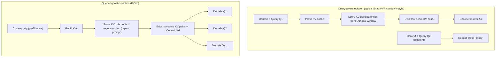
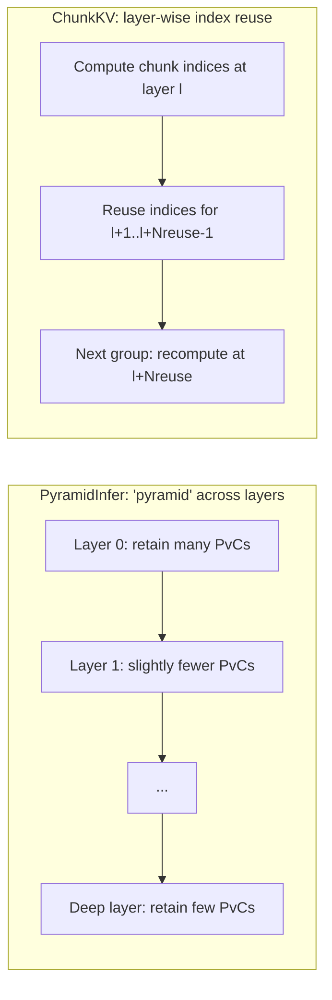

# KV Cache Compression and Retention: A Rigorous Comparison of Four Approaches

## Executive summary

Key–value (KV) cache compression has become one of the most practical levers for scaling long-context inference because KV memory grows linearly with sequence length and dominates GPU memory at large context sizes. citeturn29view0turn11view0turn41view1 Across the four papers you specified, a useful organizing axis is **what signal is used to decide what to keep**, and **whether the resulting compressed cache is reusable across multiple queries**.

**PyramidInfer (ACL Findings 2024)** is best understood as a **layer-wise, pyramid-shaped retention policy** that exploits two empirical observations: (i) **KV redundancy grows with layer depth**, and (ii) **recent tokens’ attention patterns are consistent enough to predict which context KV pairs matter for future generation**. citeturn9view1turn10view1turn4view0 It differs from many cache eviction policies in that it explicitly targets both **prefill and generation**, and it reports **substantial throughput gains under GPU-memory exhaustion experiments** (e.g., larger achievable batch sizes and higher token/s). citeturn7view0turn5view1

**PyramidKV (arXiv:2406.02069)** makes a closely related but distinct claim: attention “funnels” across layers from broad to sparse, so KV cache budgets should be **non-uniform across layers**—large in lower layers and small in higher layers—rather than a fixed cache size everywhere. citeturn11view0turn13view4 It uses an attention-score-based selection scheme (following the SnapKV line) and primarily evaluates long-context tasks (LongBench; Needle-in-a-Haystack), emphasizing strong results even at very small cache sizes. citeturn11view0turn13view7

**ChunkKV (arXiv:2502.00299)** shifts the core design choice from “token-level importance” to **chunk-level semantic preservation**: discrete token eviction can keep query-related words while dropping the subjects or semantic anchors, inducing systematic errors in multi-document QA and similar tasks. citeturn29view0 ChunkKV computes chunk importance using an **observation window** of attention scores, selects top chunks to fit a maximum retained length, and proposes **layer-wise index reuse** to amortize the compression overhead by reusing selected indices across groups of layers. citeturn31view5turn32view2

**KVzip (arXiv:2505.23416)** introduces the most conceptually different idea: existing attention-score eviction methods (including SnapKV/PyramidKV-style prefill scoring) are **query-aware**, so their compressed caches often do not generalize to new queries unless you redo prefill+compression for each query. citeturn38view0turn40view0 KVzip instead aims for a **query-agnostic compressed context cache** by scoring KV pairs through **context reconstruction** (using a “repeat the previous context” style prompt), and then evicting low-importance KV pairs. citeturn40view2turn40view5 It explicitly studies **multi-query evaluation** and reports large practical wins in memory/latency with minimal performance loss, with contexts reaching ~170K tokens. citeturn41view1turn43view8

From an implementation/practitioner perspective, the main decision points are:

- If your workload is **single-query long-context** (e.g., one question per document) and you can afford query-specific caches, **PyramidKV / PyramidInfer / ChunkKV** compete on quality–efficiency tradeoffs. citeturn11view0turn7view0turn34view0  
- If your workload is **multi-query per context** (retrieval + many follow-up queries, interactive analysis, agentic workflows), **KVzip is the only one of the four explicitly designed for cache reuse across diverse future queries**. citeturn39view5turn43view8  
- If “retention” means **semantic preservation** (not just accuracy on a fixed benchmark), ChunkKV is the most directly targeted at that failure mode. citeturn29view0turn37view2  
- None of the four provides a formal, worst-case **retention guarantee**; all rely on empirical properties of attention and token importance. KVzip explicitly notes the lack of theoretical guarantees. citeturn41view1turn32view2

## Problem framing and terminology

### KV cache cost model

For an autoregressive Transformer, KV caching stores per-token keys and values for each layer (and head). A representative cost model in ChunkKV expresses **GPU memory cost** (for float16 KV) as:

\[
\text{KV memory} \approx 2 \times B \times S \times L \times N \times D \times 2
\]

where \(B\) is batch size, \(S\) total sequence length (prompt + generated), \(L\) layers, \(N\) attention heads, \(D\) per-head dimension; the first factor 2 is keys+values and the last factor 2 corresponds to float16 precision. citeturn29view0

### Prefill vs decode and “retention”

- **Prefill**: ingesting the prompt/context to initialize KV cache for subsequent generation.  
- **Decode**: incremental generation where each step reuses the cache.

“Retention” in these papers is operationally “which KV pairs remain stored and therefore influence future attention computations.” Each method varies in:
- **Granularity**: token-level (PyramidInfer, PyramidKV, KVzip) vs chunk-level (ChunkKV). citeturn4view0turn13view4turn31view5turn40view5
- **Scope**: per-layer selection; per-head selection; or both. citeturn4view0turn40view1
- **Query dependence**:
  - “Query-aware”: importance derived from attention patterns tied to the immediate query/instruction window during prefill (PyramidKV-like baselines, and many SnapKV-style approaches). citeturn38view0turn13view5  
  - “Query-agnostic”: compressed cache designed to support diverse future queries over the same context (KVzip). citeturn40view0turn40view2  

### What counts as a “retention guarantee” here?

Across these four works, “guarantees” are empirical rather than formal:

- PyramidInfer supports its design with measured overlap/consistency statistics of selected pivotal contexts (PvCs), but does not provide a proof-style guarantee. citeturn10view1turn7view1  
- PyramidKV motivates layer-wise budgets via observed attention funneling and reports benchmark preservation at aggressive cache ratios, but again without a formal guarantee. citeturn11view0turn13view0  
- ChunkKV argues semantic preservation via chunking and shows empirical gains on NIAH/LongBench, with a complementary speedup technique (index reuse) rather than a retention theorem. citeturn29view0turn37view2turn32view2  
- KVzip explicitly states that it is empirical and does not provide theoretical guarantees about information loss from eviction. citeturn41view1  

## Deep dive: PyramidInfer

**Executive summary.** PyramidInfer compresses KV caches **layer-wise** into a “pyramid” by keeping more KV pairs in shallow layers and fewer in deeper layers, based on two observations: (i) deeper layers exhibit higher redundancy in the KV cache during inference, and (ii) the attention patterns of recent tokens are consistent enough that an ensemble of recent attention weights can serve as an oracle for selecting context KV pairs needed for near-future generation. citeturn9view1turn10view3turn4view0

**Problem statement and motivation.** The authors argue that inference differs from teacher-forced training because only the last token predicts the next token; therefore, many KV pairs that help “predict neighbors” during training may be redundant for inference. They refer to this as an **Inference Context Redundancy (ICR)** hypothesis. citeturn9view0turn9view1 The practical target is to reduce KV memory and increase throughput without large quality loss, especially under long prompts and large batch sizes where KV cache becomes the bottleneck. citeturn7view0turn5view1

### Method details

**Key definitions (ICR and PvC).** PyramidInfer introduces a **Pivotal Context (PvC)** as the subset of KV pairs with top attention weights (top-\(p\) under some retention ratio definition) for a layer; experiments show perplexity increases as PvC retention decreases, but **sensitivity drops in deeper layers**, suggesting redundancy increases with depth. citeturn9view1turn8view1

**Recent Attention Consistency (RAC).** The method needs a stable “importance” signal for selecting KV pairs beyond the last token. It defines a **Recent Ratio** for context token \(x_i\) relative to the last prompt token \(x_n\) as:

\[
d = \frac{n-i}{n}\times 100\%
\]

and splits tokens into **recent sequence** \(S_r\) (e.g., \(0<d<30\%\)) and **context sequence** \(S_c\) (\(d\ge 30\%\)). citeturn10view0turn9view3  
To quantify PvC stability, it defines a layer-wise overlap ratio:

\[
C_{l,i}=\frac{|\text{PvC}_{l,i}\cap \text{PvC}_{l,\text{last}}|}{|\text{PvC}_{l,\text{last}}|}
\]

where \(\text{PvC}_{l,\text{last}}\) is the PvC selected by the last token and \(\text{PvC}_{l,i}\) by a recent token at layer \(l\). citeturn10view1  
They find that integrating attention weights over neighboring recent tokens (an “ensemble”) increases overlap further (reported ~93% average overlap under their selection setup). citeturn10view3

**Core algorithmic loop (layer-wise PvC selection).** PyramidInfer’s operational cache update is: compute attention, form an ensemble attention signal over recent tokens, pick top-\(p\) KV indices, and shrink \(p\) over depth to form the pyramid. The paper provides an explicit per-forward-pass procedure (Algorithm 1) with:
- a recent window length \(L\),
- per-layer minimum PvC length \(N_l\),
- a decreasing \(p\) schedule (multiplying by a decay ratio). citeturn4view0turn5view2

A faithful implementation skeleton (paraphrased from Algorithm 1) is:

```text
for layer l:
  KV := concat(PvC_past[l], KV_new[l])          # keep prior PvCs + new recent tokens
  A  := attention_weights(KV)                   # attention over retained KV
  Ae := weighted_average_over_recent_tokens(A)  # ensemble attention (recent -> context)
  if len(KV) > N_l:
     idx := TopP_indices(Ae, p_l)
     KV  := gather(KV, idx)
  p_l := p_l * decay
return KV
```

citeturn4view0turn7view2

**Prefill vs generation.** Unlike methods that only compress after full KV is built, PyramidInfer stresses that it can compress in the **prefill phase** by only keeping PvCs as the initial cache, and it can continue updating PvCs in the **generation phase** using a sliding recent window. citeturn4view0

**Position encoding handling.** Because pruning removes intermediate positions, the appendix compares (i) re-encoding positions densely vs (ii) gathering original positional encodings for selected indices; “gather” performs slightly better in their downstream comparison. citeturn7view2

### Experimental setup and datasets

The paper reports evaluation across language modeling (perplexity on WikiText-2), standard benchmarks (MMLU, BBH, GSM8K, HumanEval), conversation (MT-Bench), and long-context summarization (LEval). citeturn4view0 Performance comparisons include “local” retention baselines and other system-level baselines. citeturn4view0turn7view0

### Key results and metrics

**Throughput and KV memory.** On an NVIDIA A100 80GB, PyramidInfer reports large KV memory reductions and throughput gains. For example, on a LLaMA2-13B setting with batch size 32 and input length 512+256, the KV memory drops to 11.0GB (45.4% of baseline) and throughput is 1389 token/s (2.2× vs 621 token/s baseline). citeturn7view0 Under “memory exhaustion” max-batch experiments, it admits much larger batch sizes and higher throughput than several baselines (e.g., 2.8× vs Accelerate; and further improved when combined with Deepspeed). citeturn5view2turn7view0

**Additional computation cost.** The method introduces extra compute, dominated by top-\(p\) selection (sorting). The appendix shows that at small batch sizes the overhead can offset acceleration, but becomes negligible as batch grows. citeturn7view1

### Strengths, limitations, and assumptions

PyramidInfer’s strengths are strongest when:
- KV memory is the bottleneck and batch sizes are large enough that selection overhead is amortized. citeturn7view1turn7view0  
- You need compression in both prefill and generation, rather than only post-hoc caching. citeturn4view0  

Limitations and assumptions:
- It assumes attention-based PvC selection captures the critical context; this is empirically supported via RAC overlap measurements, but not guaranteed. citeturn10view1turn7view1  
- Hyperparameters (recent window \(L\), per-layer minima \(N_l\), \(p\) decay schedule) shape the pyramid and plausibly require tuning across models/tasks; specific defaults beyond the paper’s described setups are not fully enumerated in the accessible main text (treat as **unspecified** unless you consult the referenced code). citeturn4view0turn7view2  

### Reproducibility notes

- Code availability: the paper states code availability via a public repository on entity["company","GitHub","code hosting platform"]. citeturn28search7turn28search2  
- Hardware: major efficiency tables are explicitly reported on an entity["company","NVIDIA","gpu maker"] A100 80GB. citeturn7view0turn5view1  
- Implementation gotcha: positional encoding strategy after pruning can matter (gather vs re-encode). citeturn7view2  

## Deep dive: PyramidKV

**Executive summary.** PyramidKV argues that attention over long contexts exhibits **pyramidal information funneling**: lower layers distribute attention broadly, middle layers become more document-local, and upper layers focus sharply on a few salient tokens (“massive attention” / “attention sinks”). citeturn11view0turn13view0 It then converts this observation into a design rule: use **layer-dependent KV budgets** (large early, small late), while selecting which tokens to retain using attention scores from “instruction tokens.” citeturn13view2turn13view4

**Problem statement and motivation.** The paper targets the practical memory blowup of KV caching at long contexts and questions whether “fixed cache size per layer” designs are aligned with real layer-wise attention behavior. citeturn11view0turn13view2 It frames two specific questions: whether cache strategies should be uniform across layers and whether such uniformity is computationally efficient. citeturn11view0

### Method details

**Problem formulation (layer-wise submatrices).** The paper formulates KV compression as selecting submatrices \(K'_l, V'_l\) from full \(K_l, V_l\) per layer \(l\), under per-layer budgets, so that inference on a dataset remains close to full-cache inference under task metrics. citeturn13view1

**Two-stage method.** PyramidKV consists of:
1) **KV cache size/budget allocation per layer**, and  
2) **KV cache selection within each layer/head.** citeturn13view2turn13view4

**Stage 1: Pyramidal layer budgets.** The paper retains KV for the last tokens across all layers (called “instruction tokens” / local window), controlled by a hyperparameter (symbol not rendered in the accessible HTML extract). citeturn13view3  
Given a total budget across layers, it chooses top- and bottom-layer budgets and sets middle layers using an **arithmetic sequence** to form a pyramid. citeturn13view3turn13view4  
The exact closed-form of Equation (1) is not visible in the extracted HTML view (treated here as **unspecified** in the provided sources), but the textual description implies **linear interpolation** from a large bottom-layer budget to a small top-layer budget. citeturn13view4turn38view0

**Stage 2: Token selection with instruction-token attention.** Following SnapKV-style logic, the method scores tokens by how much attention they receive from instruction/local-window tokens and retains those with higher scores. citeturn13view4turn13view5  
The paper also mentions a pooling layer to reduce sensitivity to massive activation scores, but the specific mathematical placement/index of the pooling operator is not recoverable from the accessible HTML rendering (treated as **unspecified** here). citeturn13view5turn38view0

### Experimental setup and datasets

PyramidKV reports:
- LongBench evaluation (17 datasets spanning QA, summarization, few-shot, synthetic, code), and multiple backbone models including LLaMA-3-8B-Instruct, LLaMA-3-70B-Instruct, and Mistral-7B. citeturn11view0turn13view6  
- Baselines: StreamingLLM, H2O, SnapKV, and FullKV. citeturn13view7  
- Greedy decoding across tasks for comparability. citeturn13view6  

### Key results and metrics

From the paper’s abstract-level claims:
- On LongBench, it “matches full KV cache performance” while retaining ~12% of KV cache. citeturn11view0  
- Under very tight cache (reported as ~0.7% of KV cache), it substantially outperforms other eviction methods (example: large absolute gains on TREC). citeturn11view0  
- On Needle-in-a-Haystack, it reports strong preservation even with very small KV cache entry counts (e.g., 128 KV entries for a large model reaching perfect reported accuracy in that setup). citeturn11view0  

### Strengths, limitations, and assumptions

Strengths:
- Clear, layer-wise budget principle tied to observed attention sparsity across layers. citeturn13view0turn13view2  
- Practical implementation availability through a unified framework repository with scripts for LongBench and Needle-in-a-haystack experiments. citeturn23view0  

Limitations/assumptions (including implications for “retention”):
- The selection signal derives from instruction token attention, which is **query/instruction dependent**. As later emphasized by KVzip, such methods often require repeating prefill+compression per query for multi-query contexts. citeturn38view0turn40view0  
- The method improves retention by reallocating budget across layers, but it remains within the general class of “attention-score eviction”; it does not provide formal guarantees. citeturn11view0turn41view1  

### Reproducibility notes

- Code availability is provided via a public repository (KVCache-Factory) that includes installation requirements (Transformers version constraint; FlashAttention2 support) and concrete command-line arguments (e.g., `max_capacity_prompts` used to set cache sizes, with values corresponding to paper settings like 128 and 2048). citeturn23view0  
- Some method hyperparameters are referenced but not concretely printed in the accessible arXiv HTML render (e.g., pyramid shape hyperparameter symbols at experiment setup). These details should be treated as **unspecified in the provided text**, and obtained from the code if needed. citeturn13view6turn23view0  

## Deep dive: ChunkKV

**Executive summary.** ChunkKV compresses KV caches by selecting **semantic chunks of tokens** instead of discrete tokens, motivated by the observation that token-level eviction can keep query-related terms but drop semantically necessary anchors (e.g., subjects), harming multi-document QA and other long-context reasoning. citeturn29view0 It specifies a simple chunk-scoring algorithm using attention from an observation window, and adds **layer-wise index reuse** as a system-level optimization to reduce compression overhead. citeturn31view5turn32view2

**Problem statement and motivation.** The paper argues that existing KV compression methods (StreamingLLM, H2O, SnapKV, and pyramid-shaped layer-wise variants) focus on **discrete token compression** and may not preserve semantic integrity. citeturn29view0 The stated goal is to maintain semantic information while still achieving competitive memory savings, and to reduce the additional time cost introduced by compression. citeturn29view0turn32view2

### Method details

**ChunkKV algorithm (chunk-level scoring + top-k chunks).** The paper’s Algorithm 1 can be summarized as:

1) Compute observation-window attention scores
\[
A \leftarrow Q_{T_q-w:T_q} K^\top
\]
where \(w\) is the observation window size (noted as commonly in \(\{4,8,16,32\}\)). citeturn31view6turn31view5  

2) Partition the key sequence length \(T_k\) into \(C=\lceil T_k/c\rceil\) chunks of size \(c\). citeturn31view6turn31view5  

3) Score chunk \(i\) by summing observation scores over its tokens:
\[
A_i = \sum_{j=(i-1)c+1}^{ic} A_{:,j}
\]
citeturn31view6turn31view5  

4) Select top chunks under a maximum compressed length \(L_{\max}\), i.e. \(k=\lfloor L_{\max}/c\rfloor\), and keep selected chunks in original order. citeturn31view5  

5) Concatenate the last \(w\) tokens (observation window) to ensure recent information retention by replacing the tail of the compressed cache. citeturn31view5turn31view6  

This produces compressed \(K',V'\) per layer/head. citeturn31view5

**Layer-wise index reuse.** ChunkKV empirically finds that preserved indices are highly similar between adjacent layers, quantified via average adjacent-layer Jaccard similarity; e.g., for LLaMA-3-8B, ChunkKV reports ~57.74% vs SnapKV ~27.95%. citeturn32view0 This enables the following optimization: for groups of \(N_{\text{reuse}}\) layers, compute ChunkKV indices once at the first layer and reuse them for the subsequent \(N_{\text{reuse}}-1\) layers. citeturn32view2  
If \(T_{\text{select}}\ll T_{\text{compress}}\), the theoretical speedup approaches \(N_{\text{reuse}}\). citeturn32view2

### Experimental setup and datasets

ChunkKV evaluates:
- LongBench and Needle-In-A-Haystack as long-context benchmarks, and GSM8K as an in-context learning benchmark. citeturn32view3turn37view2  
- It runs experiments multiple times and reports mean scores for robustness. citeturn32view3  
- It reports results for LLaMA-3-8B-Instruct, Mistral-7B-Instruct, and Qwen2-7B-Instruct in LongBench settings. citeturn34view0turn36view1  

### Key results and metrics

**Needle-In-A-Haystack (retrieval under long context).** Table 5 reports, for example, on LLaMA-3-8B-Instruct: ChunkKV 73.8 vs PyramidKV 65.1 vs SnapKV 58.9 vs H2O 47.9 vs StreamingLLM 23.7; FullKV is 74.6. On Mistral-7B-Instruct, ChunkKV matches FullKV at 99.8 in that setup. citeturn37view2

**LongBench (10% compression ratio case and others).** ChunkKV is consistently competitive and often best among compression methods at the reported ratios. For instance, for LLaMA-3-8B-Instruct at 10% compression, its overall average is reported as 40.51 vs FullKV 41.46, exceeding SnapKV (40.15) and PyramidKV (40.08) in that table; for Mistral-7B-Instruct at 10%, ChunkKV’s overall average is 46.71 vs FullKV 48.08. citeturn34view0turn36view1

**GSM8K (ICL reasoning).** With a 30% compression ratio (per the GSM8K settings paragraph), Table 6 reports ChunkKV 74.6 vs FullKV 76.8 for LLaMA-3-8B, and ChunkKV 73.5 vs FullKV 71.1 for Qwen2-7B. citeturn35view4turn36view5

**Chunk size sensitivity.** The paper reports that LongBench performance varies by less than ~1% across chunk sizes, and suggests chunk sizes around {10, 20} as favorable. citeturn33view7turn30view5

### Strengths, limitations, and assumptions

Strengths:
- Targets a specific, plausible failure mode of token-level eviction: loss of semantic anchors. citeturn29view0turn37view2  
- Index reuse offers a clear systems lever to reduce overhead without changing the basic selection metric. citeturn32view2turn33view3  

Limitations/assumptions:
- Chunk scoring by summed attention assumes attention concentration correlates with semantic importance of chunks; this is plausible but not guaranteed. citeturn31view6turn41view1  
- Chunking introduces an additional design dimension (chunk size \(c\)) that can interact with task type and prompt structure (the paper notes different optimal ranges for shorter prompts such as GSM8K). citeturn30view5turn33view7  

### Reproducibility notes

- The paper specifies key hyperparameters and their typical ranges (e.g., observation window \(w\in\{4,8,16,32\}\), chunk size \(c\), and compressed length \(L_{\max}\)). citeturn31view6turn31view5  
- It states the main experiments use chunk size 10 across multiple model architectures. citeturn32view2  
- Code availability: the OpenReview listing indicates the code is available via a public repository. citeturn1search5turn1search13  
- Hardware specifics for the core benchmark tables are not consistently enumerated in the extracted lines for every experiment; treat “exact compute resources per experiment” as partially **unspecified** in the snippets above, except where hardware is explicitly mentioned (e.g., RTX 4090 memory discussion as motivation). citeturn31view3turn29view0  

## Deep dive: KVzip

**Executive summary.** KVzip is a **query-agnostic KV cache eviction framework** intended for **multi-query** workloads where you want to prefill a large context once and answer many different queries without redoing prefill+compression each time. citeturn39view5turn43view8 It scores KV pairs by how necessary they are for **context reconstruction**: it prompts the model to “repeat” the context and uses the resulting cross-attention patterns to assign importance scores, then evicts low-scoring KV pairs. citeturn40view2turn40view5

**Problem statement and motivation.** KVzip’s key critique is that prefill-scored eviction methods (e.g., SnapKV/PyramidKV-style) select KV entries relevant to queries in a trailing window, so cache reuse across different queries can fail: you either re-prefill per query (high cost) or reuse a query-specific compressed cache (accuracy degradation). citeturn38view0turn40view0turn39view5

### Method details

**Importance scores as maximum cross-attention during reconstruction.** Let context length be \(n_c\). KVzip constructs an input \(x\) that is the concatenation of a repeat prompt (length \(n_{\text{prompt}}\)) and the original context (length \(n_c\)), so \(n_{\text{in}}=n_{\text{prompt}}+n_c\). citeturn40view4  
Forwarding this input through the Transformer with the prefilled context cache \(KV_c\) produces grouped-query attention maps. It defines the per-layer, per-KV-head importance score vector \(S_{l,h}\in\mathbb{R}^{n_c}\) as:

\[
S_{l,h} = \max_{g=1,\ldots,G;\ i=1,\ldots,n_{\text{in}}} \bar{A}_{l,h}[g,i]
\]

where \(\bar{A}_{l,h}\) is the attention matrix sliced to the keys corresponding to the prefilled context KV entries (so the scoring is “how much any reconstruction token attends to each cached context token,” maximized over groups and query positions). citeturn40view4turn40view5  
The aggregated \(S\in\mathbb{R}^{L\times H\times n_c}\) is then used to evict the lowest-scoring KV pairs. citeturn39view2turn40view5

**Chunked scoring for long contexts.** Direct attention on \(n_c\approx 100K+\) is infeasible; KVzip scores in chunks using FlashAttention. It uses a constant chunk size \(m=2K\) across contexts, models, and tasks. citeturn43view4turn43view3  
Algorithm 1 (appendix) details: partition the context into \(T=\lceil n_c/m\rceil\) chunks and, for each chunk, construct a repeat-style input (for \(t>1\), include a trailing span of the previous chunk to anchor continuity) and compute chunk-local attention against subsampled keys, then write the resulting chunk scores into the global score tensor. citeturn38view0turn39view2

**Eviction structure and head budgets.** KVzip adopts a non-uniform allocation across attention heads: retain KV pairs with the top \(r\%\) importance scores across all heads (with system prompt KV left intact). citeturn38view0turn43view7 For grouped-query attention, it evicts from the stored cache before replication to reduce storage. citeturn38view0

**Computational cost and a Softmax-free variant.** KVzip analyzes chunked scoring cost: using FlashAttention with chunking yields per-chunk causal-attention FLOPs and the total scoring can be on the order of the prefill cost; chunking bounds peak memory. citeturn39view7turn43view3 It reports that the scoring procedure is ~10% of total forward compute time and describes a fused-kernel variant that removes Softmax normalization (reducing overhead but degrading compression performance). citeturn39view3

**Context-independent head-level eviction.** KVzip also supports “context-independent” deployment: derive static head-level importance scores (max over sequence dimension) from a single long English text sample and then apply head-level eviction (in the DuoAttention style). This removes runtime scoring overhead after deployment but yields more moderate compression. citeturn41view1turn43view4

### Experimental setup and datasets

KVzip evaluates in a **multi-query** (query-agnostic) framework: prefill and compress once per context, then answer multiple questions. citeturn42view5turn43view8 It evaluates across:
- SQuAD, GSM8K, NIAH, and nine tasks from SCBench (which includes tasks from RULER and ∞Bench). citeturn43view8turn39view6  
- Context lengths ranging from ~100 to ~170K tokens (tokenized with Qwen tokenizer per the evaluation description). citeturn43view8turn39view6  
It reports experiments on a single NVIDIA A100 80GB GPU for consistent baseline comparison in the cited setup section. citeturn38view0

### Key results and metrics

**Overall memory/latency improvements.** KVzip states approximately **2× FlashAttention decoding latency reduction** and **~3–4× KV cache size reduction** with negligible performance loss on diverse query tasks (note: a hyphenated “3–4×” is also reflected in the associated repository description). citeturn42view12turn44view0turn41view1

**Concrete efficiency case study (124K context; A100).** Figure 8 reports, for LLaMA3.1-8B with 124K context tokens in FP16 on NVIDIA A100:
- With KV cache ratio 1.0, KV memory is 16.3GB; at ratio 0.2, KV memory is 3.3GB (and intermediate ratios scale accordingly). citeturn43view4turn43view6  
- Attention latency decreases as KV cache ratio decreases, consistent with reduced attention work on fewer keys. citeturn43view4turn43view6  
- Chunk size affects scoring overhead and peak memory; the paper uses 2K chunks and argues chunk size has negligible performance impact. citeturn43view4turn43view6turn43view3  

**Robustness to prompt wording and scoring details.** KVzip shows that varying the repeat prompt (original vs paraphrased vs none) has minimal effect on a reported SQuAD setting at 30% KV cache ratio (Table 2 in appendix). citeturn42view4turn41view1

### Strengths, limitations, and assumptions

Strengths:
- Directly addresses multi-query reuse failure of query-aware eviction policies by shifting to query-agnostic scoring. citeturn40view0turn39view5  
- Provides both a context-dependent method (higher compression; per-context overhead) and a context-independent variant (no runtime overhead after deployment). citeturn41view1turn43view4  
- Explicitly compatible with KV quantization (shows large additional cache-size reduction when combining 4-bit KV with eviction). citeturn41view1turn38view0  

Limitations/assumptions:
- KVzip explicitly notes the lack of theoretical guarantees regarding information loss from eviction. citeturn41view1  
- It introduces a scoring overhead (additional forward passes for reconstruction scoring), intended to be amortized over multiple queries; by design, this overhead is less attractive for single-query workloads unless you use the context-independent variant. citeturn41view1turn39view7  
- Its importance metric is still attention-based (max cross-attention), with the usual assumption that low-attended KV pairs contribute little to computation. citeturn40view4turn40view5  

### Reproducibility notes

- Code: KVzip provides an official repository URL and implementation. citeturn41view0turn44view0  
- Key hyperparameters are explicitly specified:
  - scoring chunk size \(m=2K\), citeturn43view4turn38view0  
  - trailing span of 8 tokens for chunk-to-chunk anchoring, citeturn38view0  
  - evaluation uses deterministic greedy decoding, citeturn42view1  
  - baseline reproduction: SnapKV/PyramidKV use max pooling kernel 7 and observation window size 32 (reduced to 16 for <1K contexts), and PyramidKV uses linearly decreasing layer-budget ratios. citeturn38view0  
- Compute: the paper states evaluations were conducted on a single NVIDIA A100 80GB GPU in its baseline comparison setup. citeturn38view0  
- Availability of public benchmarking: the paper references public leaderboard availability (KVPress leaderboard), which is relevant for verifying relative performance trends (though not a substitute for reproducing full runs). citeturn41view1turn44view0  

## Comparative analysis and practical recommendations

### Comparative analysis table

The table below emphasizes differences in **objective**, **signal**, **granularity**, **cache reusability**, and **systems cost**. “Retention guarantee” is interpreted as any explicit formal guarantee (none here), or the primary empirical retention mechanism.

| Method | Primary objective | Compression signal | Granularity | Layer/head structure | Prefill vs decode handling | Cache reuse across multiple queries on same context | Retention mechanism | Main overhead driver | Best-use scenarios |
|---|---|---|---|---|---|---|---|---|---|
| PyramidInfer | High-throughput inference by shrinking KV memory, especially at scale | Ensemble attention from recent window to context; top‑p PvC selection | Token indices | Layer-wise pyramid (keep more shallow, less deep) | Compresses prefill and updates during generation (sliding window) | Not designed for multi-query reuse; tuned to ongoing generation | RAC-based stability of “shared PvCs”; explicit min PvC length per layer | top‑p selection cost (sorting), especially at small batch sizes | Serving workloads where KV memory caps batch size; streaming-like long prompts |
| PyramidKV | Preserve long-context ability while reducing KV memory | Attention from “instruction tokens” guiding per-head token selection (SnapKV-like) | Token indices | Pyramidal layer budgets (arithmetic/linear decreasing) | Primarily prefill-based selection (compressed context cache used for decoding) | Generally query-aware; cache reflects instruction/query | Keeps instruction/local window across layers; allocates more budget to lower layers | attention-score computation + gather; modest additional complexity | Single-query long-context QA/summarization (LongBench/NIAH style) under fixed cache budget |
| ChunkKV | Semantic-preserving compression & efficiency | Observation-window attention \(Q_{window}K^\top\) aggregated over chunks | Chunk indices (then token indices via chunk ranges) | Can be combined across layers via index reuse | Compress per layer; adds layer-wise index reuse to cut cost | Still query-aware in typical use; reuse is across layers, not across queries | Keeps top‑k semantic chunks + last \(w\) tokens | chunk scoring + top‑k selection; reduced by index reuse | Long-context QA where semantic anchors matter; scenarios where chunking stabilizes selection |
| KVzip | Query-agnostic compressed context cache reusable across queries | Reconstruction-based max cross-attention importance over context, chunked scoring | Token indices (and optionally head-level) | Pair-level scores; head-budget allocation; optional head-only eviction | Prefill once; score via reconstruction forward passes; decode many queries with same cache | Yes: designed for multi-query reuse; also offers context-independent head-level mode | Reconstructability proxy; “repeat context” scoring | scoring overhead (extra forward passes), amortized over multiple queries | Multi-query contexts (agents, document analysis); long contexts (100–170K) |

**Sources for the major differentiators:** PyramidInfer’s layer-wise PvC selection and generation updates are defined in Algorithm 1 and surrounding text. citeturn4view0turn7view1 PyramidKV’s two-stage design (pyramidal budgets + SnapKV-like selection) is described in its method section. citeturn13view2turn13view4turn13view5 ChunkKV’s chunk scoring and index reuse are explicitly given by Algorithm 1 and the layer-wise reuse analysis. citeturn31view5turn32view2 KVzip’s multi-query motivation, reconstruction scoring equation, chunked evaluation, and head-budget eviction are detailed in Sections 2–4 and the appendix algorithm. citeturn40view0turn40view5turn38view0turn43view8

### Architecture and data-flow diagrams



This diagram corresponds to KVzip’s stated multi-query motivation (Figure 1/2 narrative) and its “repeat prompt” scoring vs the per-query prefill + eviction pattern of query-aware approaches. citeturn39view5turn40view0turn40view2



PyramidInfer’s explicit “decrease p with depth” design and ChunkKV’s “reuse indices across Nreuse layers” are directly described in their method/analysis sections. citeturn4view0turn32view2

### Toy walkthroughs

To make the mechanisms concrete, consider a short context of 24 tokens, and suppose you can only retain 8 context tokens (plus whatever “recent/local” tokens are always kept).

#### PyramidInfer (layer-wise PvC selection)

1. Split tokens into recent \(S_r\) and context \(S_c\) using the “recent ratio” idea (paper uses a recent-vs-context split with \(d<30\%\) in its RAC study). citeturn10view0turn9view3  
2. For a given layer \(l\), compute attention weights from recent tokens to the context slice, average/aggregate across recent tokens (the algorithm uses a weighted average), and keep top-\(p_l\) indices. citeturn4view0turn10view3  
3. Enforce a minimum retained length \(N_l\), and decrease \(p_l\) with depth, so shallow layers may keep (say) 8 context tokens, while deep layers keep (say) 2–3. citeturn4view0turn5view2  
4. During decoding, update the recent window and repeat selection to keep the cache bounded. citeturn4view0

**Practical intuition:** shallow layers store distributed context signals; deep layers concentrate on fewer relevant tokens, so dropping more in deeper layers is less damaging. citeturn9view1turn8view4

#### PyramidKV (pyramidal budgets + instruction-token scoring)

1. Always retain “instruction tokens” (local window at the end of the prompt) at every layer. citeturn13view3  
2. Allocate layer budgets \(B_l\) in a linearly decreasing/arithmetic pattern from bottom to top layers. citeturn13view4turn38view0  
3. For each layer/head, compute attention-based importance scores for earlier tokens as “how much they are attended by instruction tokens,” apply pooling (to mitigate massive activation artifacts), and select top tokens to match \(B_l\). citeturn13view5turn38view0  

**Toy outcome:** Layer 0 might keep 8/24 tokens (broad attention), while Layer 30 might keep 2/24 (sparse attention).

#### ChunkKV (chunk selection)

Let chunk size \(c=4\), so tokens partition into 6 chunks: \([1..4], [5..8], \dots, [21..24]\).

1. Compute observation-window attention scores \(A \leftarrow Q_{\text{window}}K^\top\). citeturn31view5turn31view6  
2. Chunk scores \(A_i\) are sums over tokens in each chunk. citeturn31view5turn31view6  
3. If \(L_{\max}=8\), then \(k=\lfloor 8/4\rfloor=2\): keep the top-2 chunks (8 tokens total), preserving chunk integrity (e.g., subject–verb–object span stays together). citeturn31view5  
4. Replace the last \(w\) tokens of the compressed cache with the original last \(w\) tokens to preserve recency. citeturn31view5turn31view6  

**Layer-wise index reuse in the toy:** if layers 10–13 select nearly the same chunks, you can compute chunk indices at layer 10 and reuse for 11–13, saving repeated scoring. citeturn32view0turn32view2

#### KVzip (context reconstruction scoring)

Assume 3 queries will be asked about the same 24-token context.

1. Prefill once to get \(KV_c\). citeturn38view0turn40view2  
2. Score KV pairs by running a reconstruction forward pass with input = “Repeat the previous context:” + context, and compute per-token importance via max cross-attention (Equation 2). citeturn40view4turn40view5  
3. Evict the lowest-scoring KV pairs to reach the chosen KV cache ratio \(r\). citeturn43view7turn39view2  
4. Reuse the same compressed cache to decode all 3 queries without re-prefilling. citeturn40view0turn43view8  

**Key intuition:** tokens needed to reconstruct the full context tend also to be useful across many downstream tasks (paper supports this with attention-overlap analyses). citeturn39view1turn40view5

### Practical recommendations for choosing or combining methods

**If you serve long-context inference at high throughput (many concurrent requests):** PyramidInfer’s reported gains are explicitly in throughput and batch size under KV memory pressure; it is a strong candidate when throughput is the primary KPI and you can tune/engineer around its top‑p overhead. citeturn7view0turn7view1

**If your workload is long-context single-shot QA/summarization:** PyramidKV and ChunkKV both target LongBench/NIAH-style setups and can perform well under aggressive cache budgets. ChunkKV’s results suggest chunking can improve NIAH retrieval performance relative to token-level baselines at comparable cache ratios (e.g., in Table 5 and Table 4 settings). citeturn37view2turn34view0turn36view1

**If your workload is multi-query-per-context (agents, interactive doc analysis, repeated retrieval):** KVzip is the clearest match because it is explicitly designed for single prefill + cache reuse across diverse queries, whereas query-aware methods are documented to degrade when reusing a compressed cache. citeturn40view0turn39view5turn43view8

**If you want semantic robustness under compression:** ChunkKV’s framing is the most directly aligned with semantic preservation, and its chunk-size sensitivity analysis suggests you can gain robustness with modest tuning. citeturn29view0turn33view7

**Combination strategies (implementation-oriented).** Several combinations are technically plausible and motivated by the papers’ modular components:

- **KVzip scoring + ChunkKV retention structure**: Use KVzip’s reconstruction-derived token importance scores to rank tokens, but enforce chunk coherence during retention (retain complete spans around highly scored tokens), aiming to preserve semantic anchors while staying query-agnostic. KVzip already scores per-token; ChunkKV already provides a chunk-structured retention policy. citeturn40view5turn31view5turn29view0  
- **KVzip token scores + PyramidKV layer budgets**: Compute token scores once (query-agnostic), then allocate per-layer budgets via a pyramid schedule to exploit layer-wise sparsity (as PyramidKV motivates). citeturn40view5turn13view4  
- **ChunkKV + PyramidInfer-style depth-dependent decay**: ChunkKV currently uses chunk scoring with top‑k under \(L_{\max}\); you could make \(L_{\max}\) layer-dependent (larger in early layers, smaller in late), aligning with the “pyramid” insight shared by PyramidInfer/PyramidKV. citeturn31view5turn4view0turn13view2  

These combinations are not explicitly evaluated in the four papers and should be treated as hypotheses to test (see next section). citeturn41view1turn32view2

## Open research questions and suggested follow-up experiments

### Follow-up experiments that would be high-value

**Multi-query stress tests for non-KVzip methods.** KVzip makes the key point that query-aware eviction fails under cache reuse. To validate whether PyramidKV/ChunkKV/PyramidInfer can be adapted for multi-query reuse, a direct experiment would be: prefill once on a multi-query dataset (e.g., SQuAD-style multiple Qs per context), compress once, then answer all queries without re-prefill. This is essentially the KVzip evaluation protocol and would reveal how much degradation comes from query dependence. citeturn40view0turn43view8

**Semantic failure-mode benchmarks beyond NIAH.** ChunkKV motivates “subject dropping” type errors. A useful extension would be: construct targeted probes where the correct answer depends on retaining syntactic/semantic relations (coreference chains, subject–predicate pairs, negation), and measure error types under equal memory budgets across methods. The NIAH and LongBench results show performance gaps but do not isolate error classes. citeturn29view0turn37view2turn34view0

**Layer-wise budget optimization vs fixed pyramids.** Both PyramidInfer and PyramidKV rely on a “pyramid” heuristic (depth-dependent shrinkage pattern), but the best shape may be model- and task-dependent. An experiment: learn (or search) per-layer budgets under a fixed total KV budget, comparing:
- linear decay (PyramidKV-like), citeturn38view0turn13view4  
- power-law-like decay (PyramidInfer motivation), citeturn8view4turn5view2  
- adaptive per-layer budgets based on measured information loss proxies (e.g., attention recall rate, KV L1-loss, or downstream score). citeturn34view0turn32view2  

**End-to-end latency accounting (prefill + scoring + decode).** PyramidInfer and KVzip highlight different overhead regimes: PyramidInfer adds per-layer selection overhead during forward passes; KVzip adds extra reconstruction passes (amortized). A careful study should report:
- single-query latency (prefill + any scoring + decode),
- multi-query amortized latency per query,
- memory peak, and
- throughput under realistic batching. citeturn7view1turn39view7turn43view6

### Open questions for theory and mechanistic understanding

**When do attention-based importance scores fail?** All four methods fundamentally assume that attention-derived signals correlate with downstream utility. KVzip empirically studies sparsity and overlap between reconstruction attention patterns and task attention patterns, but still does not provide a guarantee. citeturn39view1turn41view1 A key open question is whether there exist systematic counterexamples (e.g., tasks requiring rare but crucial low-attention tokens).

**What is the right object to preserve: tokens, chunks, heads, or layers?** ChunkKV’s index similarity evidence suggests that “important indices” are structured across layers, enabling reuse. citeturn32view0turn32view2 KVzip suggests head-level static scores can provide a no-overhead deployment mode, but with reduced compression efficiency. citeturn41view1turn43view4 A unified framework might treat (layer, head)-specific compression as a joint allocation problem under a global budget.

**How should “retention” be evaluated beyond accuracy?** KVzip’s behavior analysis suggests eviction can change refusal/privacy behaviors, implying that KV cache manipulation can modify safety/alignment-related outputs even when task accuracy remains stable. citeturn41view1turn42view3 This points to an under-explored evaluation axis: safety and behavioral invariances under compression.

### Practical implementation outlook

A pragmatic “researcher-implementation” path emerging from these papers is:

1) Establish a stable, multi-query evaluation harness (KVzip’s framing) so cache reuse effects are measured directly. citeturn43view8turn40view0  
2) Compare token-level vs chunk-level retention under identical per-layer and per-head budgets (to isolate the semantic effect). citeturn31view5turn34view0  
3) Add budget-shaped variants (linear vs power-law decay) and measure sensitivity. citeturn5view2turn13view4  
4) Profile full-system costs: peak memory, prefill latency, scoring overhead, and decode latency, ideally using FlashAttention-style kernels and explicitly reporting hardware (A100-class) for cross-paper comparability. citeturn43view6turn7view0turn38view0  

