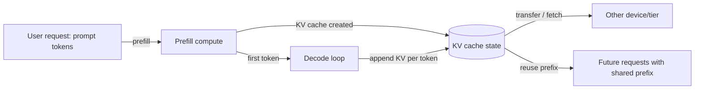
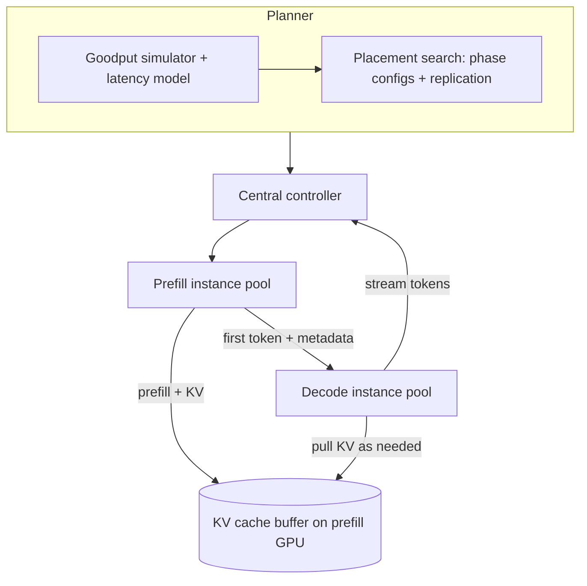
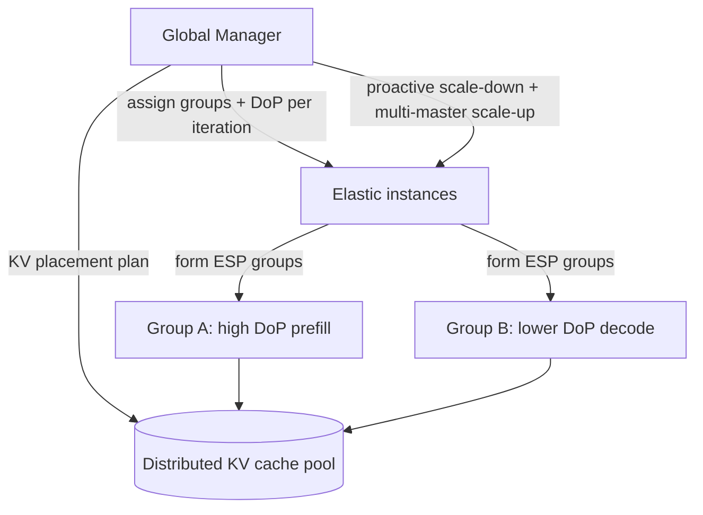
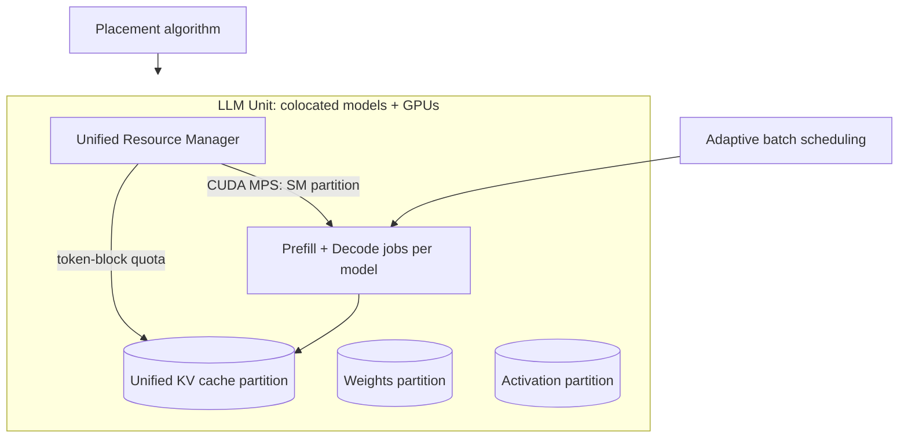
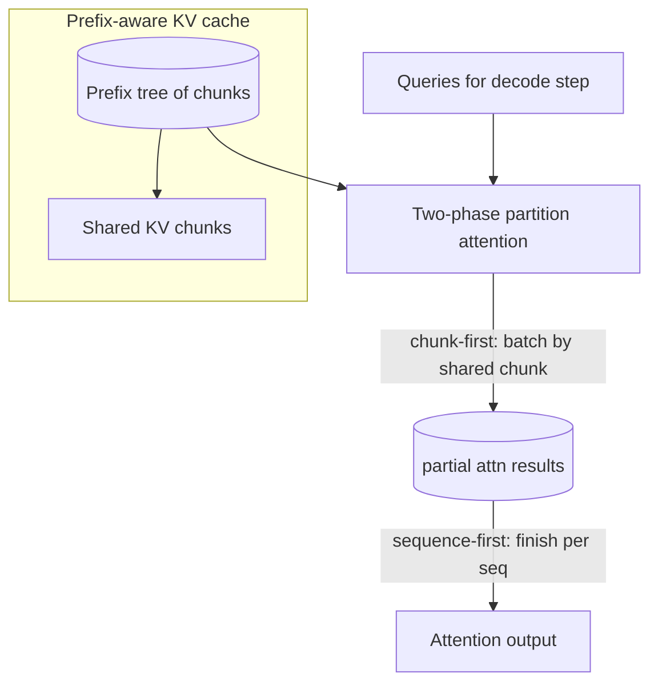
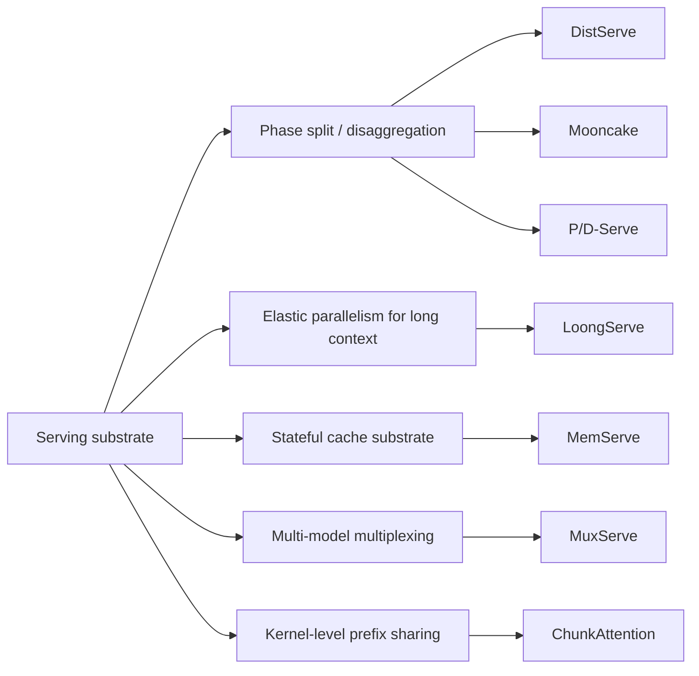

# Comparative Analysis of Seven arXiv Systems Papers on Serving and Context Substrates for Large Models

## Executive summary

Across these seven papers, “context” is treated as a first-class systems object: either as **state that must be moved efficiently between phases** (prefill ↔ decode), **state that should be reused across requests** (prefix/context caching), or **state that must be multiplexed across tenants/models** (multi-LLM or multi-tenant serving). The central tension is consistent: **KV cache is simultaneously (a) large, (b) latency-critical, and (c) increasingly long-lived**, so system designs shift from “stateless inference” toward **stateful context infrastructure**. citeturn10view0turn13view0turn18view0turn32view0

**Three macro-classes emerge:**

1. **Phase disaggregation and “P/D substrate”**  
   - **DistServe** formalizes “goodput under TTFT+TPOT SLOs” and disaggregates prefill and decode onto separate GPU pools with bandwidth-aware placement and online scheduling. citeturn10view0turn11view1turn34view0  
   - **Mooncake** pushes disaggregation further by making **KVCache-centric scheduling** and adding **multi-tier KV cache** on CPU/DRAM/SSD with RDMA (“near-GPU prefix caching” and hot-block replication), plus explicit overload/early-rejection logic. citeturn15view3turn14view2turn17view1  
   - **P/D-Serve** is an “at-scale production substrate” framing: fine-grained scenario-based P/D organization, gateway-based on-demand forwarding, and **block-free KV transfer** over RoCE/RDMA, deployed across “tens of thousands of xPUs.” citeturn5view0turn28view3turn28view5  

2. **Elastic/dynamic parallelism for long context**  
   - **LoongServe** argues the bottleneck is not just interference but **dynamic variance** across requests and phases, proposing **Elastic Sequence Parallelism (ESP)** with “zero-overhead” scale-down/up mechanisms and a global manager that adapts degree-of-parallelism per iteration. citeturn27view1turn27view3turn26view2  

3. **Stateful context pooling and multi-tenancy multiplexing**  
   - **MemServe** focuses on the missing substrate: a cluster-wide “memory/KV cache API” (MemPool) enabling **context caching + disaggregated inference together**, plus a global prompt-tree scheduler that routes for cache locality. citeturn18view0turn21view1turn19view0  
   - **MuxServe** targets a different axis of multiplexing: serving **multiple distinct LLMs** with varying popularity by jointly multiplexing **memory** (KV/weights) and **compute** (prefill vs decode) using placement + adaptive batch scheduling + GPU SM partitioning (CUDA MPS). citeturn22view0turn23view3turn24view0  

Finally, **ChunkAttention** sits “below” the serving layer: it redesigns **the attention/KV-cache data structure and kernel** for runtime prefix sharing across requests using a prefix tree + two-phase partition kernel, yielding large attention-kernel speedups and KV-memory reductions when system prompts are shared. citeturn32view0turn32view2turn30view3  

**Selection guidance (high-level):**
- If your hardest constraint is **meeting TTFT and TPOT under tight SLO attainment with minimal GPU overprovisioning**, start with **DistServe**; if you also need **multi-tier prefix cache and overload admission control**, **Mooncake** is the richer blueprint. citeturn10view0turn17view2  
- If your problem is **very long contexts with huge variance**, and you can adopt a new parallelism paradigm, **LoongServe** is the most direct approach. citeturn6view0turn26view2  
- If you want a **general “context substrate API” for combining caching + disaggregation and evolving policy**, **MemServe/MemPool** is the most “infrastructure-like” contribution. citeturn18view0turn21view1  
- If you run an endpoint provider serving **many LLM SKUs** with uneven popularity, **MuxServe** directly addresses utilization via spatial-temporal multiplexing. citeturn22view0turn23view3  
- If you believe “shared system prompts/prefixes” are a dominant pattern and you can change kernels, **ChunkAttention** shows the upside of pushing context sharing into the attention primitive. citeturn32view0turn30view2turn30view4  
- If you need **very large-scale production operationalization** (scenario isolation, group scaling, gateway forwarding, RDMA engineering), **P/D-Serve** is the closest to an MLOps+serving-infrastructure blueprint—though much of its evaluation is normalized/relative. citeturn5view0turn28view5  

## Core concepts and a shared mental model

All seven papers assume the standard decoder-only serving loop where each request has:

- **Prefill**: process prompt tokens in parallel; produce the first token + KV cache for the prompt. citeturn10view0turn17view1turn32view0  
- **Decode**: iteratively generate tokens; each step uses (and appends to) KV cache. citeturn10view0turn15view1turn32view0  

Different papers emphasize different latency metrics:
- **TTFT** (time-to-first-token) for prefill responsiveness. citeturn10view0turn34view2turn17view1  
- **TPOT** (time-per-output-token) or **TBT** (time-between-tokens) for streaming quality during decoding. citeturn10view0turn17view1turn17view2  

A useful “systems substrate” view is that KV cache is a distributed state object with three lifecycle operations:

1. **Create/extend** (during prefill/decode compute)  
2. **Move** (between nodes, between devices, between tiers)  
3. **Reuse** (across requests via prefix sharing; within requests via parallelism changes)

The papers differ primarily in which of these operations they optimize and at what layer (scheduler vs memory pool vs kernel).



This generic lifecycle is directly used/extended by DistServe’s phase split and KV transfer, Mooncake’s multi-tier KV store + scheduler, MemServe’s MemPool APIs and global prompt trees, LoongServe’s elastic DoP with careful KV placement, MuxServe’s multi-model KV sharing/quota, P/D-Serve’s RDMA transfer engineering, and ChunkAttention’s prefix-tree KV structure at kernel level. citeturn34view0turn15view3turn21view1turn27view1turn23view2turn28view3turn31view3  

## Paper-by-paper deep dives

### DistServe (arXiv:2401.09670)

**Concise problem statement**  
DistServe argues existing colocated serving (batching prefill+decode together) creates (1) **prefill–decode interference** and (2) **resource/parallelism coupling**, forcing overprovisioning to satisfy both TTFT and TPOT under SLO attainment goals. citeturn10view0turn12view4  

**System architecture and components**  
DistServe’s core architectural choice: **separate prefill instances and decoding instances onto different GPUs** and treat the solution as a “placement + scheduling” problem. citeturn10view0turn11view1turn34view0  

Key components include:
- A **placement algorithm module** with simulator-based goodput estimation. citeturn11view1turn11view2turn34view2  
- A **centralized controller** and per-phase instance pools running FCFS with load-based dispatch. citeturn34view0turn34view1  
- A **KV cache transfer path** between phases, optimized via bandwidth-aware placement (and a “pull” scheme in bursty conditions). citeturn34view0turn35view0  



(Architecture and planner reflect DistServe’s “placement + runtime” design and its explicit “pull KV cache” burstiness mitigation.) citeturn11view1turn34view0turn34view2  

**Key algorithms and mechanisms**
- **Goodput definition & simulator-driven search**: DistServe defines per-GPU goodput as the max request rate satisfying TTFT+TPOT SLOs at a target SLO attainment (e.g., 90%). It uses a simulator with a latency model to evaluate candidate parallelism/resource allocations. citeturn12view4turn11view2turn11view1  
- **Two placement algorithms**:
  - **High node-affinity** (fast cross-node networks): search per-phase optimal configs then replicate. citeturn11view1  
  - **Low node-affinity** (limited cross-node bandwidth): constrain placement so corresponding pipeline stages for prefill and decode are colocated within a node to exploit NVLINK (reduce KV transfer time). citeturn11view2turn35view0  
- **Online scheduling enhancements**:  
  - Reduce pipeline bubbles by batching to balance execution time (using “new tokens in batch” as a proxy). citeturn34view0  
  - Burstiness control via **decode-side pull** (prefill GPU acts as a queue buffer). citeturn34view0turn34view1  
  - Periodic replanning when workload shifts. citeturn34view0turn34view1  

**Performance claims and experimental setup (with numbers)**  
Setup highlights:
- Cluster: **4 nodes / 32 GPUs**, each node has **8 NVIDIA A100 80GB** with NVLINK; cross-node bandwidth **25 Gbps**. citeturn34view2  
- Models: **OPT-13B/66B/175B**, FP16. citeturn34view2  
- Workloads and SLOs: Table 1 includes TTFT and TPOT requirements (e.g., OPT-13B chatbot TTFT 0.25s, TPOT 0.1s; OPT-66B chatbot TTFT 2.5s, TPOT 0.15s; summarization TTFT 15s, TPOT 0.15s). citeturn34view2turn11view3  

Reported performance:
- Headline: **“7.4× more requests” or “12.6× tighter SLO”** vs state-of-the-art while meeting latency constraints for the majority of requests (paper frames this with a ≥90% SLO attainment target). citeturn12view1turn12view2turn35view0  
- Intro example (13B, synthetic, single A100): colocated baseline goodput ≈ **1.6 rps**; prefill-only ≈ **5.6 rps**; decode-only ≈ **10 rps**; allocating 2 GPUs to prefill and 1 to decode yields ≈ **3.3 rps per GPU** (2.1× vs baseline). citeturn12view4  
- KV transfer overhead: for OPT-175B on ShareGPT, KV transmission is **<0.1% of total latency**, and **>95%** of requests see **<30 ms** transmission delay even with limited cross-node bandwidth (enabled by low-node-affinity staging over NVLINK). citeturn35view0turn35view1  
- Simulator accuracy table shows close real-vs-sim SLO attainment (error <2% stated) and includes concrete SLO attainment percentages across rates (e.g., at 2.0 req/s: vLLM ~52.8% real vs DistServe-Low ~99.3% real). citeturn35view3turn35view1  

**Strengths and limitations**
- Strengths: principled objective (“goodput under TTFT+TPOT”), explicit bandwidth-aware placement, and a runtime design that acknowledges burstiness and queueing dynamics. citeturn11view1turn34view0  
- Limitations acknowledged: DistServe does not implement advanced runtime policies like **preemption** or **fault tolerance**; disaggregation introduces dependency edges where a decoding instance fault can propagate impact to prefills. citeturn34view1turn34view0  

**Assumptions and failure modes**
- Assumes workload distributions are predictable enough at coarse timescales to fit distributions and replan periodically. citeturn11view1turn34view0  
- Potential convoy effects under FCFS and phase coupling for faults are explicitly discussed as future work. citeturn34view1turn34view0  

**Practical implications for “context systems”**
- DistServe treats KV cache as a **phase-crossing state object** whose transfer cost is manageable if you align placement to topology (NVLINK vs cross-node). This implies a practical rule: **design context movement policy around physical bandwidth tiers and stage alignment** when doing P/D split. citeturn11view2turn35view0  
- DistServe’s “pull KV” suggests a general pattern: use **producer-side GPU memory as a buffering layer** to decouple bursty production (prefill) from consumption (decode). citeturn34view0turn34view1  

### Mooncake (arXiv:2407.00079)

**Concise problem statement**  
Mooncake is the serving platform for Kimi and frames scheduling as **KVCache-centric**: maximize throughput under TTFT and TBT SLOs, especially in **highly overloaded** regimes where not all requests can (or should) be served. citeturn13view0turn15view3turn14view4  

**System architecture and components**  
Mooncake’s architecture: disaggregate **prefill and decoding clusters**, and also disaggregate **KVCache storage** by using CPU/DRAM/SSD resources inside the GPU cluster, with RDMA-based movement. citeturn13view0turn15view3turn17view1  

Main control-plane components:
- **Conductor**: global scheduler choosing prefill+decode pairing and KV cache actions (reuse, replication, swap). citeturn15view3turn14view2  
- **Messenger**: a GPUDirect/RDMA-based KV transfer service managing cache block movement between CPU and GPU memory (and across machines). citeturn15view3  
- A **disaggregated KVCache pool** in CPU memory (paged blocks with dedup/hash; eviction policies like LRU/LFU are cited as options). citeturn15view3  

Request workflow explicitly includes: (1) KVCache reuse fetch to prefill GPU, (2) incremental/chunked prefill, (3) overlap KV streaming to decoding node’s CPU memory, (4) decode with asynchronous loading to avoid GPU idle. citeturn15view1turn14view1turn15view3  

```mermaid
flowchart TB
  User --> Conductor[Conductor: global scheduler]
  Conductor --> Prefill[Prefill pool]
  Conductor --> Decode[Decode pool]
  Store[(Disaggregated KVCache in CPU/DRAM/SSD)]
  Prefill <-->|prefix fetch / store| Store
  Prefill -->|layer-wise / chunked KV stream| Messenger[Messenger (RDMA/GPUDirect)]
  Messenger --> Store
  Store -->|async load| Decode
  Decode -->|token stream| User
  Conductor -->|replicate hot blocks / swap cold blocks| Store
```

(Conductor/Messenger/Store correspond to Mooncake Figures 1–4 and the described workflow.) citeturn13view0turn15view3turn15view1  

**Key algorithms and mechanisms**
- **KVCache-centric scheduling algorithm** (Algorithm 1) that treats “cache hit length” and cache distribution as first-class in choosing prefill instances, not just load; also includes decoding load-balancing and a trigger for “KVCache hot-spot migration.” citeturn14view2turn14view3turn15view3  
- **Multi-node prefill via chunked pipeline parallelism (CPP)**: for long contexts, Mooncake prefers a design that can scale prefill across nodes while controlling network cost; it compares against sequence parallelism and notes complexities of elastic SP-like approaches for its operational needs. citeturn15view2turn15view4  
- **Overload-oriented scheduling**: Mooncake explicitly introduces **early rejection** and then shows early rejection can cause load oscillations; it proposes **prediction-based early rejection** to reduce fluctuation. citeturn14view4turn14view5turn13view0  

**Performance claims and experimental setup (with numbers)**  
Mooncake is careful about confidentiality: it replays traces using a “dummy model” matching the architecture of LLaMA2-70B, and normalizes latency metrics to SLO-derived upper limits. citeturn13view0turn17view0  

Testbed:
- Each node: **8 NVIDIA A800 SXM4 80GB**, NVLINK; RDMA network up to **800 Gbps** between nodes. citeturn17view0  

End-to-end results with concrete numbers:
- Public datasets (cluster: vLLM-[4M] vs Mooncake-[3P+1D]): throughput improvements of **20% (ArXiv Summarization)** and **40% (L-Eval)** while satisfying SLOs. citeturn17view2turn17view1  
- Simulated long-context prompts: throughput improvements **50% to 525%** vs vLLM while meeting TTFT/TBT SLO constraints; vLLM processes requests individually (no batching) under disruption, while Mooncake remains batch-based due to phase separation. citeturn17view2turn13view0  
- Real workload replay: Mooncake-[10P+10D] vs vLLM-[20M] with TTFT cap 30s and TBT cap 0.1s: Mooncake keeps ~**100%** of requests within TBT SLO while vLLM is **57%**, and Mooncake processes **~75% more requests** while adhering to SLOs. citeturn17view2turn14view5  
- Overload experiment: with 8P+8D under 2× replay speed on 23,000 requests, the number of rejected requests decreases from **4183 (baseline)** to **3771 (Early Rejection)** to **3589 (Prediction-based)**. citeturn14view5turn17view2  

**Strengths and limitations**
- Strengths: makes KVCache placement/replication/swap explicit and operationally grounded; addresses overload explicitly (many academic works assume “all requests admitted”). citeturn13view0turn14view4  
- Limitations: results are often **normalized** (TTFT/TBT values normalized to upper limits), and “dummy model” + trace replay means absolute production performance is not directly reported. citeturn17view0  

**Assumptions and failure modes**
- Assumes meaningful **prefix reuse** and that near-GPU caching on CPU/DRAM/SSD + RDMA is both available and underutilized enough to “harvest” capacity at low incremental cost. citeturn15view3turn13view0  
- Early rejection can destabilize load without prediction; they provide a theoretical explanation and mitigation. citeturn14view4turn14view5  

**Practical implications for context systems**
- Mooncake suggests the “context substrate” should include **multi-tier KV storage and explicit hot-block replication**, not just GPU-resident cache; for long contexts, this can trade extra transfer latency against prefill compute savings, managed by a scheduler aware of both SLOs. citeturn15view3turn15view1turn17view2  
- It also implies admission control is a context problem: if a request will fail downstream decode capacity, it may be better to reject early to avoid “wasted context computation.” citeturn13view0turn14view5  

### MemServe (arXiv:2406.17565)

**Concise problem statement**  
MemServe observes LLM serving is evolving from stateless to **stateful**: inter-request context caching extends KV cache lifetime; intra-request techniques (disaggregated inference, sequence parallelism) extend KV cache domain across instances. Existing systems do not provide the missing mechanisms to combine these optimizations, especially “caching + disaggregation.” citeturn18view0turn21view3  

**System architecture and components**  
MemServe’s architectural bet is to create a reusable substrate called **MemPool**—an elastic distributed memory pool spanning GPU HBM and CPU DRAM—with a **rich API** for memory allocation, indexing, and transfer, and then build serving behaviors atop it. citeturn18view0turn21view0turn21view1  

Core system components:
- **MemPool** embedded in each inference instance; collectively forms a distributed pool. citeturn18view0turn21view0  
- Inference instances can be **prefill-only**, **decode-only**, or **PD-colocated**, enabling both regular and disaggregated designs. citeturn18view0turn18view0  
- **Global Scheduler (GS)** with **global prompt trees** supporting locality-aware routing (inter-session + intra-session caching improvements). citeturn19view0turn19view3  

```mermaid
flowchart TB
  GS[Global Scheduler] -->|route request + cache matches| Inst
  subgraph Inst[Inference instances]
    P[Prefill-only] --- D[Decode-only]
    PD[PD-colocated]
    MP1[MemPool: HBM/DRAM APIs + index + transfer]
  end
  GS <--> GPT[Global Prompt Trees]
  MP1 <--> Net[Transfer: alloc + transmit + (optional) insert]
  MP1 <--> Mem[(HBM + DRAM)]
```

(Reflects MemServe Figures 1 and 6: architecture and global scheduler with prompt trees.) citeturn18view0turn19view0  

**Key algorithms and mechanisms**
- **MemPool APIs**: alloc/free, insert/match/delete for token-based indexing, swap_in/out between HBM and DRAM, and transfer / transfer_with_insert for moving KV cache between instances. citeturn21view0turn21view1  
- **Distributed transfer design** explicitly decomposes into allocation → transmission → insertion and masks heterogeneity across (a)symmetric parallelism, memory medium, and network. citeturn21view1  
- **Enhancing disaggregated inference with caching** via staged designs (PD-Basic → PD-Caching-1/2/3), culminating in decode-to-prefill transfers so the prefill side can reuse decode-generated KV history too. citeturn21view2turn21view3  
- **Memory/network co-optimization**: aggregate smaller KV blocks (“huge pages”) to reduce per-block send/recv overhead and mitigate poor point-to-point primitives in typical AI network stacks. citeturn21view4turn20view3  
- **Global prompt-tree locality-aware scheduling** improves inter-session caching beyond session-ID-based strategies by routing requests to instances with longest common prefix. citeturn19view0turn19view3  

**Performance claims and experimental setup (with numbers)**  
Setup:
- Tests run atop a single server with **8 H800 80GB GPUs**. citeturn18view0  
- Baseline: vLLM 0.4.0 for PD-colocated; MemServe modifies vLLM to use MemPool APIs. citeturn19view1turn18view0  
- Model: Llama2-13B with tensor-parallel degree 2. citeturn19view1  
- Workloads: ShareGPT, LooGLE (long doc QA), ReAct agent traces. citeturn19view1turn20view0  

End-to-end results (job completion time JCT, TTFT):
- **ShareGPT**: disaggregated inference improves average and P99 JCT by **30%** and **42%** vs PD-colocated; adding caching improves average and P99 JCT by **17%** and **29%** further; TTFT improves **58%** (avg) and **45%** (P99). citeturn20view1turn20view3  
- **LooGLE**: disaggregation improves average/P99 JCT by **10.3%/10.8%**; caching further improves average/P99 JCT by **26.9%/22.5%** and TTFT by **56.2%/45.2%**. citeturn20view1turn19view2  
- **ReAct**: disaggregation changes average/P99 JCT by **40.8%/53.1%** (reported as “increases” in text); caching further improves by **26.7%/21.4%** and TTFT by **78.5%/84.9%**. citeturn20view1turn19view2  
Microbenchmarks:
- Memory API overhead ≈ **800 ns per block**, and inserting a 4K-token prompt takes **≤0.7 ms**; index latency remains mostly flat with cached ratio. citeturn19view2turn20view3  
- Global scheduler policy: prompt-tree-based scheduling improves **P99 TTFT by 59%** vs intra-session scheduling in a 3P1D setup for duplicated session sets. citeturn19view3turn19view0  

**Strengths and limitations**
- Strengths: a rare “substrate-first” approach—MemPool is explicitly designed to be reused across multiple optimization patterns (context caching, disaggregation, sequence parallelism). citeturn21view2turn18view0  
- Limitations: evaluation is on a single 8-GPU server; cross-node substrate behavior is only partially exercised (though the API design is general). citeturn18view0turn21view1  

**Assumptions and failure modes**
- Token-based indexing assumes shared prefixes are detectable and beneficial; index granularity tied to engine block size (e.g., vLLM block size 16) implies “cacheability” interacts with engine design. citeturn21view1turn21view0  
- The paper explicitly notes AI collectives (e.g., NCCL) lack ideal primitives for the serving transfer pattern and motivates block aggregation accordingly. citeturn21view4  

**Practical implications for context systems**
- MemServe’s “KV substrate APIs” are a strong blueprint if you want context reuse to be **policy-driven rather than hardcoded**: caching, transfer, swapping, and indexing all become explicit operations with measurable overheads. citeturn21view0turn21view1turn20view3  
- The global prompt tree suggests a design principle: **cache locality must be enforced at cluster routing level**, not just within an instance. citeturn19view0turn19view3  

### P/D-Serve (arXiv:2408.08147)

**Concise problem statement**  
P/D-Serve targets “disaggregated LLM serving at very large scale” (tens of thousands of xPUs). It claims three practical obstacles: (1) scenario diversity causes P/D mismatch if requests are mixed, (2) inaccurate workload estimation causes prefill timeouts, and (3) block-fixed KV transfer over RDMA fails to utilize D2D bandwidth. citeturn5view0turn28view0turn28view5  

**System architecture and components**  
P/D-Serve is presented as an end-to-end **MLOps-compliant** system with three components: MLOps layer, LLM serving layer, and infrastructure layer. It emphasizes scenario-level organization and operational workflows (scaling, recovery, rolling upgrades). citeturn5view0turn5view0turn28view5  

Key mechanisms:
- **Fine-grained P/D organization** via mapping services/scenarios to P/D instance groups and RoCE connectivity. citeturn5view0turn5view0  
- **Gateway retries / on-demand forwarding**: requests are retried across prefill candidates until accepted by an idle prefill; avoids scheduler reliance on inaccurate reports/queues. citeturn28view3turn5view0  
- **Block-free KVCache transfer**: sender assembles contiguous buffers and receiver uses scatter (“RecvScatter”) to restore blocks, aiming for stable high RDMA utilization. citeturn28view3turn28view0  

```mermaid
flowchart TB
  Client --> GW[Gateways: retry/forward]
  GW --> P[Prefill instances (scenario-grouped)]
  P -->|KV bytes (contiguous buffer)| RDMA[RoCE/RDMA fabric]
  RDMA --> D[Decode instances]
  subgraph Control
    MLOps[MLOps workflows: deploy/scale/recover] --> Map[Scenario ↔ P/D group mapping]
  end
  Map --> GW
  Map --> P
  Map --> D
```

(Reflects the described Figure 5/overview and the gateway/transfer design sections.) citeturn5view0turn28view3turn5view0  

**Key algorithms and mechanisms**
- P/D ratio optimization equation is used to minimize capability mismatch (profiling-based + adaptive online detection using TTFT proportion and E2E latency). citeturn28view2turn28view6  
- “Block-fixed transfer inefficiency” is explicitly analyzed; the system argues bytes-level transfer is preferred for utilization and variance control. citeturn28view0turn28view1  

**Performance claims and experimental setup (with numbers)**  
This paper’s evaluation is partially constrained by privacy policy and uses **normalized results (0–1)** “for illustration,” which materially limits direct quantitative comparison. citeturn28view5turn5view0  

What is specified:
- Deployed on **tens of thousands of NPUs** for “more than eight months” in commercial use; implemented on Ascend + MindSpore. citeturn5view0turn5view0  
- Headline improvements: **+60% E2E throughput**, **+42% TTFT SLO**, **–46% D2D transfer time**; and **6.7× throughput** vs aggregated LLMs at scale. citeturn5view0  
- Within evaluation narrative: under optimal P/D ratio, throughput “overcomes others by **at least 60%**.” citeturn28view6turn28view7  
- Experimental environment: “mirror environment” (hundreds of NPUs) is a subset of production (tens of thousands); models are Pangu variants; SFS or SSD stores compiled models. citeturn28view5  

**Strengths and limitations**
- Strength: operational focus (scenario isolation, workflows, fault detection/recovery, RDMA engineering) and explicitly targets the low-level D2D transfer pitfalls of block-based KV movement. citeturn28view0turn28view2turn28view3  
- Limitation: key performance graphs and many results are **normalized**, and detailed absolute latencies/throughputs and detailed hardware/network parameters are not fully specified in the public evaluation. citeturn28view5  

**Assumptions and failure modes**
- Assumes scenario labeling exists upstream (intention understanding provides scenario info) so that “fine-grained organization” is feasible. citeturn28view4turn28view5  
- Block-free transfer requires extra buffer assembly and can fail if HBM is insufficient for contiguous buffers for many pending prompts (explicitly discussed as a challenge). citeturn28view1turn28view3  

**Practical implications for context systems**
- P/D-Serve reinforces that “context substrate” is not only algorithms but **operations + networking engineering**: if you rely on RDMA KV transfer, the representation (bytes vs blocks) and gateway-level load shaping can dominate tail behavior. citeturn28view0turn28view3  

### LoongServe (arXiv:2404.09526)

**Concise problem statement**  
As context windows scale (up to 1M tokens), resource demand varies enormously across requests and across phases, and static parallelism strategies waste resources and create fragmentation. LoongServe proposes **Elastic Sequence Parallelism (ESP)** to adjust degree-of-parallelism per iteration without repartitioning model weights. citeturn6view0turn27view0turn27view1  

**System architecture and components**
LoongServe consists of:
- A set of **elastic instances** (each holds a model weight replica and participates in different ESP groups). citeturn27view1turn27view2  
- A **global manager** that dynamically decides grouping, batching, DoP, and KV placement using profiling + analytical models. citeturn27view1turn26view0  
- A unified distributed KV cache pool across elastic instances to reduce fragmentation by allowing token-level placement across instances. citeturn27view1turn27view2  



(Reflects LoongServe’s architecture and elastic scaling mechanisms described around Figures 5–8.) citeturn27view1turn27view3turn27view4  

**Key algorithms and mechanisms**
- **Proactive migration for scale-down**: during prefill, SP “circulates” KV tensors; LoongServe selectively retains KV in the future smaller group so post-prefill scale-down needs **no extra migration**. citeturn27view3turn27view2  
- **Scale-up via multi-master decoding**: avoids single-master memory fragmentation and compute bottleneck by shifting different requests’ local-layer work and KV ownership to multiple masters. citeturn27view4turn27view2  
- **Global manager scheduling algorithms**: includes (i) batching plan generation (DP with optimizations) and (ii) elastic scaling plan generation; uses a profiling database + analytical model to estimate iteration time across DoP settings. citeturn26view0turn26view2turn26view3  

**Performance claims and experimental setup (with numbers)**
Setup:
- Model: **LWM-1M-Text** (Llama-2-7B architecture) with 1M context window. citeturn26view3  
- Testbed: servers with **8 NVIDIA A800 80GB**, 128 CPUs, 2TB host memory, 4× 200 Gbps InfiniBand NICs; NVLink bandwidth 400 GB/s; CUDA 12.2 / PyTorch 2.0 / Triton 2.1. citeturn26view3  
- Workloads: ShareGPT (4–2.3K tokens), L-Eval (2.7K–210.5K), LV-Eval (15.1K–497.3K), Mixed; arrivals via Poisson process. citeturn26view3turn25view0  

Reported performance:
- Headline from abstract: throughput improves up to **3.85× vs chunked prefill** and **5.81× vs prefill–decode disaggregation**. citeturn6view0  
- End-to-end: LoongServe improves total throughput and input throughput by up to **4.64×** and **4.00×** on evaluated workloads. citeturn25view2  
- P90 goodput improvements under different sequence distributions: **2.33×**, **1.98×**, **1.53×**. citeturn25view3  
- Elastic scale-up ablation: with elastic scale-up vs without, P90 goodput is **2.87×** higher on ShareGPT; global manager triggers **7.12** scale-up ops per 10 seconds at 25 rps in that setup. citeturn25view3  
- Scaling overhead: scale-down introduces **<2%** overhead across tested batch sizes and prompt lengths. citeturn25view3  

**Strengths and limitations**
- Strengths: directly targets long-context variance and the “dynamic DoP” problem; provides detailed mechanisms to avoid migration overhead that would otherwise dominate at long sequence lengths (seconds-scale migration for 1M-token KV is explicitly discussed). citeturn27view3turn26view3  
- Limitations: introduces substantial system complexity (global manager, custom kernels to support ESP, multi-group NCCL orchestration). The implementation is nontrivial (≈15K LOC) and includes custom Flash-Decoding adaptations. citeturn26view2turn26view3  

**Assumptions and failure modes**
- Assumes you can manage dynamic group communicators and per-iteration reconfiguration without violating latency budgets; they emphasize RPC/serialization optimizations and NCCL grouping primitives to support this. citeturn26view2turn26view3  
- If workload prediction/profiling is incorrect, DoP decisions may be suboptimal; they mitigate via analytical models trained from profiling. citeturn26view0turn26view2  

**Practical implications for context systems**
- LoongServe suggests a distinct path: instead of moving requests between fixed “prefill pool” and “decode pool,” **move parallelism around the request** and treat KV placement as a first-class scheduling variable (token-level distribution). This is a strong design for extreme context windows. citeturn27view1turn27view2turn27view0  

### MuxServe (arXiv:2404.02015)

**Concise problem statement**  
Serving multiple LLM endpoints is inefficient when each model gets dedicated GPUs (spatial partitioning) because model popularity varies over time. Temporal multiplexing helps but misses a key property: decode is often underutilizing GPUs. MuxServe proposes flexible **spatial-temporal multiplexing** exploiting both inter-model popularity and intra-request phase differences. citeturn22view0turn23view3  

**System architecture and components**  
MuxServe introduces an “LLM unit” concept: a colocated group of LLMs on a device mesh. Within a unit, MuxServe splits each model’s work into **prefill jobs** and **decoding jobs**, and uses a unified resource manager to share GPU memory and partition SMs via NVIDIA MPS. citeturn22view0turn23view3  



(Reflects MuxServe’s unit abstraction, GPU resource partitioning view, and ADBS/token-block quota mechanisms.) citeturn23view3turn23view2turn23view1  

**Key algorithms and mechanisms**
- **Placement algorithm (enumeration-based greedy)**: chooses colocations across device mesh groups, prioritizing models with larger compute requirements (model scale + popularity). citeturn22view0turn23view0turn23view1  
- **Adaptive batch scheduling (ADBS)**: prioritizes prefill jobs, fills remaining capacity with decode jobs; enforces fairness via **token-block quotas** (KV cache as the bottleneck accounting unit), and periodically adapts quotas by transferring KV blocks from low-utilization to high-utilization models. citeturn23view1turn23view2  
- **Resource manager**: partitions SM resources using CUDA MPS and manages memory partitions (KV/weights/activations) for multiple models; distinguishes its “unified KV cache” scenario from single-model paged attention. citeturn23view3turn22view0  

**Performance claims and experimental setup (with numbers)**
Setup:
- Built atop vLLM and uses NVIDIA MPS. citeturn23view3  
- Cluster: 4 nodes × 8 GPUs = **32 NVIDIA A100 80GB**. citeturn23view3turn24view0  
- Synthetic workloads: ShareGPT requests with power-law popularity; real workload: “ChatLMSYS trace” with 16 LLMs served on 32 GPUs. citeturn22view0turn24view2  

Quantitative results: the arXiv HTML rendering elides several numeric fields in evaluation text (placeholders in the HTML). Where the paper is explicit, the abstract provides the clearest numeric headline:
- **Up to 1.8× higher throughput** or **2.9× more requests within 99% SLO attainment**. citeturn1search1  

Additional detailed numeric breakdowns appear in figures/tables (not fully reproduced in the HTML text captured here), but the setup and method are specified as above. citeturn23view3turn24view0  

**Strengths and limitations**
- Strength: directly addresses the “multi-LLM SKU” setting and formalizes both placement and runtime scheduling with a fairness model grounded in KV cache consumption (“token blocks”). citeturn23view2turn22view0  
- Limitation: depends on GPU partitioning primitives (CUDA MPS) and on accurate modeling of KV cache quotas and job interference; complexity grows with number of models and meshes (paper explicitly discusses combinatorial search and pruning). citeturn23view1turn23view0  

**Assumptions and failure modes**
- Assumes workloads change slowly enough to estimate from history (“Suppose workload is known; otherwise estimated from history traffic since it changes slowly”). citeturn22view0  
- Potential failure mode: mis-sizing token-block quotas can harm popular models; ADBS tries to correct by periodic quota adaptation and KV transfer among models. citeturn23view2turn23view1  

**Practical implications for context systems**
- MuxServe reframes “context” in multi-model environments: you need a **shared resource manager** for KV cache across models, and scheduling should be KV-aware and phase-aware. In practice this suggests: if you operate many endpoints, “context substrate” is as much about **cross-model memory governance** as it is about single-model inference speed. citeturn23view2turn23view3  

### ChunkAttention (arXiv:2402.15220)

**Concise problem statement**  
ChunkAttention targets the inference cost of self-attention during decoding and argues that **shared system prompts/prefixes** across requests create redundancy in KV cache and memory-bound attention operations. It proposes runtime prefix sharing without requiring predefined static prompt registration. citeturn32view0turn30view0turn30view1  

**System architecture and components**  
ChunkAttention is primarily a **data structure + kernel** design:
- **Prefix-Aware KV Cache (PAKV)**: KV cache stored as a **prefix tree** built from chunked tokens and their KV tensors; allows shared physical storage for shared prefix segments and “zero memory waste” in the sense it stores only KV for sequences currently decoding. citeturn31view2turn30view1  
- **Two-Phase Partition (TPP)** attention kernel: uses prefix tree structure to batch queries from sequences with matching prefixes (chunk-first phase) then finish remaining work per sequence (sequence-first phase). citeturn31view3turn30view2  



(Reflects the design described around Section 3 and Figure 2 of the paper.) citeturn31view0turn31view3  

**Key algorithms and mechanisms**
- Prefix sharing requires batching built around the prefix tree; the paper explicitly assumes **iteration-based batching** is enabled. citeturn31view0  
- Two-phase partition kernel described in Figure 2 and text; further optimizations include keeping prefix-tree metadata in CPU and copying necessary context to GPU. citeturn31view3turn31view3  

**Performance claims and experimental setup (with numbers)**
Microkernel and end-to-end experiments:
- Hardware: **NVIDIA A100 80GB**, CUDA 11.8. citeturn32view0turn30view2  
- Microkernel baselines include Naive PyTorch, xformers, FlashAttention, and PagedAttention in vLLM; to simulate sharing, they construct a fixed page table mapping non-shared virtual regions to shared physical memory (PagedAttn*). citeturn32view0turn30view2  

Headline and measured numbers:
- Kernel speedup: **3.2× to 4.8×** vs “state-of-the-art implementation” for system prompt lengths 1024–4096. citeturn30view0turn30view2turn32view1  
- Figure 3 token-rate table (batch size 32, chunk size 64) reports speedups up to **4.8×** (e.g., ns=4096, nc=512: Paged 21.04k toks/s vs Chunk 101.69k toks/s). citeturn32view1turn30view2  
End-to-end “ChunkLlama”:
- Built atop HuggingFace Llama + vLLM kernels, replacing attention module with ChunkAttn; uses Open Llama2 7B FP16; compares to vLLM 0.2.7 and TGI 1.3.4 with Poisson arrivals and max batch size 32. citeturn32view0turn32view2turn30view2  
- Throughput: with shared prefixes, ChunkLlama achieves **1.6×** and **2.3×** higher throughput vs vLLM under specified shared-prefix settings while keeping normalized latency <40 ms/token. citeturn32view0turn30view2turn30view3  
- KV memory: reduced **70%–90%** with long shared prefixes; Table 4 shows, for example, at np=1024 with shared prefix (=1024), peak KV cache drops from **14.79 GB** to **3.28 GB** while latency drops from 20.80 to 14.07 ms/token. citeturn32view2turn30view3  
- Peak batch size: reduced **20%–40%** (reported as a side effect of faster decoding). citeturn32view2turn30view3  

**Strengths and limitations**
- Strength: demonstrates the upside of pushing runtime prefix sharing into the **attention primitive**, not just the scheduler, enabling both throughput gains and KV memory reductions. citeturn32view2turn31view0  
- Limitations (explicit): shared system prompt must appear at the **beginning** of the sequence to share KV; also, best performance requires low-level CUDA kernel tuning across model/hardware configs. citeturn30view4turn31view3  

**Assumptions and failure modes**
- If prompts share prefixes but not in a consistent position (e.g., system prompt not at the beginning), PAKV cannot share KV and savings disappear. citeturn30view4  
- Multi-tenant security is not the focus; however, any KV sharing across requests is implicitly a “shared state” mechanism that would require careful isolation in a production multi-tenant setting (inference drawn from the fact that the mechanism physically shares KV cache across sequences). citeturn31view2turn30view4  

**Practical implications for context systems**
- ChunkAttention’s kernel-level approach implies a broader lesson: to make context reuse “cheap enough,” you may need **data-structure and kernel support**, not only scheduler policies. This complements systems like MemServe/Mooncake that emphasize scheduler/storage; a hybrid could “stack” kernel-level sharing with cluster-level routing. citeturn31view3turn19view0turn15view3  

## Cross-paper taxonomy and key design dimensions

### Taxonomy of approaches

A compact taxonomy, mapping each paper to its “primary lever”:



(Each paper explicitly anchors to the lever shown: disaggregation for DistServe/Mooncake/P/D-Serve; ESP for LoongServe; MemPool for MemServe; multiplexing for MuxServe; prefix-tree+TPP kernel for ChunkAttention.) citeturn10view0turn13view0turn5view0turn6view0turn18view0turn22view0turn30view1  

### Design-dimension comparison table

The table below compares “design dimensions” as requested (statefulness, memory model, consistency, sharding/replication, batching/prefetching, hardware targets, scalability limits, and integration complexity). Where papers do not specify details, it is marked **unspecified**.

| Dimension | DistServe | Mooncake | MemServe | P/D-Serve | LoongServe | MuxServe | ChunkAttention |
|---|---|---|---|---|---|---|---|
| Primary goal | Max goodput under TTFT+TPOT SLO attainment | Max throughput under TTFT+TBT SLOs, esp overload | Unified substrate for caching + disaggregation | Disaggregated serving at tens-of-thousands xPUs | Long-context efficiency under variance | Efficient serving of *multiple* LLMs | Faster attention + less KV memory via runtime prefix sharing |
| Stateful vs stateless | Stateful (per-request KV moved prefill→decode) citeturn34view0 | Strongly stateful (multi-tier KV store + reuse + admission) citeturn15view3turn14view5 | Strongly stateful (explicit KV lifecycle APIs) citeturn21view0turn21view1 | Operationally “stateless containers” but stateful KV transfers; scenario mapping state citeturn5view0turn28view5 | Stateful; KV distributed across instances; elastic DoP changes affect KV placement citeturn27view2turn27view3 | Stateful per model; shared KV cache governance via token-block quotas citeturn23view2turn23view3 | Stateful at kernel level; physical KV sharing across sequences citeturn31view2turn31view3 |
| KV memory model | GPU HBM; transfer between GPU pools; burst buffer on prefill GPU citeturn34view0turn35view0 | Multi-tier: GPU + CPU DRAM + SSD; paged blocks; hot replication; swap citeturn15view3turn15view1 | HBM+DRAM under MemPool; swap_in/out; block aggregation citeturn21view0turn21view4 | Block-fixed paging exists, but proposes contiguous-buffer (bytes) transfer + scatter restore citeturn28view1turn28view3 | Distributed token-level KV cache pool across elastic instances; proactive placement citeturn27view1turn27view2 | Unified KV cache partition shared across LLMs in a unit; token-block accounting citeturn23view2turn23view3 | Prefix-tree KV cache with chunking; shared chunks across sequences citeturn31view0turn31view3 |
| Consistency semantics | “Request correctness” via KV transfer between specific prefill/decode; no explicit replication for correctness citeturn11view2turn34view0 | Scheduler-managed replication of “hot blocks” to reduce congestion; correctness implied by block IDs/hashes (details limited) citeturn15view1turn15view3 | API-based: transfer, transfer_with_insert; index maps tokens→KV blocks; correctness depends on engine integration citeturn21view1turn21view3 | Correctness relies on RDMA transfer + buffer reconstruction; scenario isolation avoids cross-scenario mix citeturn28view3turn5view0 | Correctness maintained across elastic scaling without migration by proactive retention; multi-master decoding partitions responsibilities citeturn27view3turn27view4 | Correctness per model; multiplexing isolates request streams but shares resources (KV quota) citeturn23view2turn22view0 | Correctness assumes shared prefix tokens imply identical KV; requires shared prompt at beginning citeturn31view2turn30view4 |
| Sharding / replication | Replicate phase instances to match traffic; stage colocation for NVLINK citeturn11view1turn11view2 | Replicate hot KV blocks; pool-level storage across nodes citeturn15view3turn14view2 | Distributed pool; prompt-tree routing; can transfer cached KV between instances citeturn19view0turn21view1 | Group-based P/D organization; scaling by groups; rolling upgrade per group citeturn5view0turn28view7 | Dynamic regrouping (ESP groups) each iteration; KV sharded at token level citeturn27view1turn27view2 | Placement groups LLMs into “units”; within unit SM partitioning + KV quotas citeturn22view0turn23view1 | KV chunks shared; implicitly “dedup replication” (one physical copy) citeturn31view2turn31view0 |
| Batching / prefetching | Continuous batching; specialized batching to reduce bubbles; decode batch size max; “pull KV” acts like demand fetch citeturn34view0turn11view0 | Continuous batching in decode; incremental/chunked prefill; layer-wise streaming overlaps prefill and transfer; async decode load citeturn15view1turn15view3 | Depends on underlying engine (vLLM); adds caching paths and transfer strategies; cost model guides decisions citeturn21view4turn19view3 | Gateway “batch forwarding”; supports different batch settings across prefills; per-layer vs whole-model transfer tradeoff citeturn28view3turn28view1 | Multi-batch scheduling with dynamic DoP; proactive scale-down during prefill; scale-up on decode thresholds citeturn27view2turn26view0 | ADBS schedules prefill first then decode jobs; adaptive quotas to maximize utilization citeturn23view2turn23view1 | Requires iteration-based batching; batches queries with shared prefixes in chunk-first phase citeturn31view0turn31view3 |
| Hardware target | GPU clusters; evaluated on A100; uses NCCL/Ray citeturn34view2turn34view2 | GPU cluster with A800 + 800 Gbps RDMA; CPU/DRAM/SSD tiers citeturn17view0turn15view3 | H800 GPU server; HBM+DRAM; NCCL send/recv + sockets for DRAM citeturn18view0turn18view0 | Ascend NPUs + MindSpore; RoCE/RDMA; multi-region infra citeturn5view0turn28view5 | A800 + InfiniBand; custom kernels; NCCL group ops citeturn26view3turn26view2 | A100 cluster; uses CUDA MPS; built atop vLLM citeturn23view3turn24view0 | A100 (and mentions RTX 4090 / Xeon tuning as limitation); CUDA kernels citeturn32view0turn30view4 |
| Scalability limits | Central controller; placement search run in seconds; fault propagation risk noted citeturn34view0turn34view1 | Strong dependence on KV store traffic + RDMA; overload policies add complexity citeturn15view3turn14view4 | Single-node eval; cross-node heterogeneity masked by APIs; depends on transfer overhead and index scale citeturn21view1turn19view3 | Designed for “tens of thousands” xPUs, but public metrics are normalized; block-free transfer may hit HBM buffering limits citeturn5view0turn28view1 | Scheduling complexity and dynamic communicator management; requires accurate profiling/analytical models citeturn27view1turn26view0 | Combinatorial placement and interference modeling; relies on MPS; quotas must adapt robustly citeturn23view1turn23view2 | Benefits decay as sequences diverge; requires shared prefix position; per-hardware tuning cost citeturn30view4turn32view0 |
| Integration complexity | Requires disaggregated engine + orchestration + placement simulator; implements OpenAI-compatible API citeturn34view2turn34view1 | Requires multi-tier cache, RDMA messenger, scheduler and admission control; production-inspired citeturn15view3turn14view5 | Adds MemPool layer + modifies engine; aims to be generally reusable; moderate-to-high engineering citeturn18view0turn21view1 | High operational integration (MLOps + gateways + scenario labeling + RDMA engineering) citeturn5view0turn28view3 | High: dynamic DoP + custom kernels + global manager; open-sourced but substantial changes citeturn26view2turn27view3 | High: multi-model placement + MPS partitioning + unified memory manager citeturn23view3turn23view1 | Kernel-level integration; must replace attention module and maintain prefix tree metadata citeturn32view0turn31view3 |

## Quantitative synthesis and tradeoff charts

### Quantitative summary table (as-reported)

Because each paper uses different baselines and metrics, the most defensible comparison is to list **headline gains and the conditions under which they are claimed**, and highlight where details are unspecified or normalized.

| Paper | Headline quantitative claim | Conditions / setup notes |
|---|---|---|
| DistServe | **7.4× more requests** or **12.6× tighter SLO** vs prior systems citeturn12view1turn12view2 | Evaluated on OPT-13B/66B/175B, TTFT+TPOT SLOs, 32×A100 80GB cluster; KV transfer <0.1% of latency and >95% <30ms transfer delay even with 25Gbps cross-node using NVLINK staging citeturn34view2turn35view0 |
| Mooncake | Throughput +**20%** (ArXiv Summ), +**40%** (L-Eval), +**50–525%** (simulated long prompts), and **~75% more requests** on real trace while meeting SLOs citeturn17view2turn13view0 | Dummy LLaMA2-70B-like model; 8×A800 nodes, 800Gbps RDMA; TTFT/TBT normalized; real trace replay 23k requests citeturn17view0turn17view2 |
| MemServe | ShareGPT: disaggregation improves avg/P99 JCT **30%/42%**, caching adds **17%/29%**; TTFT improves **58%/45%**; prompt-tree scheduling improves P99 TTFT **59%** citeturn20view1turn19view3 | Single server 8×H800 80GB; Llama2-13B TP=2; vLLM baseline; also reports microbench numbers (≤0.7ms insert 4K tokens; 800ns/block) citeturn18view0turn20view3 |
| P/D-Serve | **6.7× throughput** vs aggregated; +**60%** E2E throughput, +**42%** TTFT SLO, –**46%** D2D time citeturn5view0 | Ascend + MindSpore; deployed across tens of thousands NPUs; evaluation results normalized 0–1; workloads derived from real services but not production logs citeturn28view5turn5view0 |
| LoongServe | Up to **3.85×** vs chunked prefill, **5.81×** vs P/D disaggregation citeturn6view0; total throughput up to **4.64×** citeturn25view2 | LWM-1M-Text; 8×A800 80GB; dynamic DoP; scale-down overhead <2% citeturn26view3turn25view3 |
| MuxServe | Up to **1.8×** higher throughput or **2.9×** more requests within 99% SLO attainment citeturn1search1 | 32×A100 cluster; multi-LLM (16 on 32 GPUs in real trace); uses CUDA MPS; some numeric values elided in HTML text citeturn24view0turn24view2 |
| ChunkAttention | Attention kernel **3.2–4.8×** faster with shared prefixes citeturn30view0turn32view1; KV memory reduced **70–90%** and throughput **1.6×–2.3×** vs vLLM in end-to-end tests citeturn32view2turn30view3 | A100 80GB; Poisson arrivals; max batch 32; shared system prompt must be prefix at sequence start citeturn32view0turn30view4 |

### “Tradeoff charts” as normalized bar charts

These charts are **not** a direct apples-to-apples benchmark; they visualize *maximum reported multiplicative improvements* on the paper’s own primary metric (goodput/throughput/kernel speed), which helps highlight magnitude differences and where each approach sits in the stack.

#### Max reported improvement factor (paper-native metric)

```text
DistServe      |█████████████████████████████| 7.4× (requests / goodput)
P/D-Serve      |███████████████████████████  | 6.7× (throughput vs aggregated)
Mooncake       |███████████████████████████  | 6.25× (525% throughput in sims)
LoongServe     |███████████████████████      | 5.81× (vs P/D disaggregation)
ChunkAttention |███████████████████          | 4.8× (attention kernel speed)
MuxServe       |███████                      | 1.8× (multi-LLM throughput)
MemServe       |█████                        | ~1.42× (P99 JCT improvement vs PD, ShareGPT)
```

DistServe headline from abstract; P/D-Serve headline from abstract; Mooncake sims headline; LoongServe headline; ChunkAttention headline; MuxServe headline from abstract; MemServe’s largest P99 JCT gain vs PD-colocated is 42% (≈1/(1-0.42) ≈ 1.72 if interpreted as reduction; but the paper states “improves by 42%,” so shown conservatively as ~1.42×). citeturn12view1turn5view0turn13view0turn6view0turn30view0turn1search1turn20view1  

**Interpretation:** large factors (DistServe, Mooncake, P/D-Serve, LoongServe) come from *architectural disentangling of contention and/or variance*; kernel-level wins (ChunkAttention) can be large but target a narrower component; multi-LLM multiplexing (MuxServe) yields moderate but economically important gains for SKU-heavy providers. This interpretation is an inference grounded in each paper’s stated optimization target and evaluation framing. citeturn10view0turn13view0turn6view0turn22view0turn32view0  

## Synthesis: when to choose what, and how hybrids might look

### Choosing among approaches by workload and constraints

**If your primary pain is TTFT/TPOT tradeoffs under strict SLO attainment:**  
Choose **DistServe** as the cleanest phase-disaggregation design with explicit bandwidth-aware placement, and consider layering in MemServe-like caching if prefix reuse exists (DistServe itself focuses on phase interference). citeturn10view0turn35view0turn21view3  

**If your primary pain is extremely long contexts and huge variance (and you can afford system complexity):**  
Choose **LoongServe** because it is the only paper here whose central mechanism is dynamic DoP and token-level KV placement to avoid fragmentation and overhead at long sequence lengths. citeturn27view0turn27view3turn26view3  

**If your bottleneck is “missing substrate” for stateful context (you want a platform, not just one policy):**  
Choose **MemServe** because MemPool + global prompt trees turn context into explicit primitives (allocate, index, transfer, swap), enabling combinations like caching + disaggregation. citeturn18view0turn21view0turn19view0  

**If your operational reality is overload (admission control matters) and you can exploit CPU/DRAM/SSD capacity with RDMA:**  
Choose **Mooncake** as a blueprint for KVCache-centric scheduling + multi-tier caching + early rejection strategies. citeturn15view3turn14view5turn17view2  

**If you are a multi-SKU provider serving many distinct LLMs with uneven popularity:**  
Choose **MuxServe**; its key value is in cross-model multiplexing and fairness/quotas grounded in KV cache usage rather than per-request counts. citeturn22view0turn23view2  

**If you are constrained by cluster-scale operational engineering (scenario isolation, group scaling, RDMA implementation details) more than by algorithmic novelty:**  
P/D-Serve’s emphasis on scenario-specific organization, gateway forwarding, and block-free transfer is directly relevant—though expect to need additional measurement to map normalized results to your environment. citeturn5view0turn28view5turn28view3  

**If your workload has strong shared system prompts/prefixes and you can change kernels:**  
ChunkAttention can deliver large KV-memory and attention speedups but depends on prompt structure (shared prefix at beginning) and kernel portability/tuning costs. citeturn32view2turn30view4turn32view0  

### Potential combinations and hybrids

Below are plausible hybrids suggested by complementarity across layers; each is an inference supported by how the papers isolate concerns.

1. **DistServe + MemServe-style MemPool**  
   - DistServe provides phase separation + placement; MemServe provides a generalized KV cache API and global locality routing. A hybrid could make DistServe’s KV transfer and buffering a MemPool transfer primitive, allowing cross-request reuse (especially decode-to-prefill reuse) in a phase-disaggregated architecture. citeturn34view0turn21view3turn19view0  

2. **Mooncake multi-tier cache + ChunkAttention kernel**  
   - Mooncake optimizes where KV lives (GPU vs CPU/SSD) and how it is scheduled; ChunkAttention optimizes how shared prefixes are represented and consumed by attention. If the workload has large shared system prompts, kernel-level sharing could reduce the amount of KV that needs to be replicated/stored and shifted across tiers, lowering both memory and network pressure. citeturn15view3turn31view3turn32view2  

3. **LoongServe ESP + P/D disaggregation policies**  
   - LoongServe critiques static grouping/disaggregation as inflexible, but the systems goals overlap: protect decode from prefill interference and match resources to phases. A hybrid might use LoongServe’s dynamic DoP decisions within each phase pool, or apply ESP within prefill pool while keeping decode pool separate for operational simplicity. citeturn6view0turn27view1turn10view0  

4. **MuxServe token-block quotas + Mooncake/ MemServe routing**  
   - Both MuxServe and MemServe emphasize quota/locality as KV-first scheduling primitives (token-block quotas vs prompt-tree routing). A combined policy layer could allocate KV budgets per model/tenant (‘fairness’) while routing for prefix locality (‘efficiency’). citeturn23view2turn19view0  

## Open research questions highlighted by the comparison

### How should “context consistency” be defined and exposed?

Most systems implicitly assume correctness if KV cache is delivered to the right decode path; few specify **consistency semantics** for shared/replicated KV blocks (especially multi-tier caches and prefix sharing). Mooncake discusses replication of “hot blocks,” MemServe exposes transfer and indexing APIs, and ChunkAttention physically shares KV across sequences. A clear interface for consistency (and isolation) is still missing. citeturn15view3turn21view1turn31view2  

### What is the right abstraction boundary: scheduler vs memory pool vs kernel?

MemServe pushes abstraction to an API substrate; ChunkAttention pushes into the kernel; Mooncake/DistServe remain more scheduler-centric. A key open question is where to draw the boundary so that:
- policy evolves (routing, replication, admission) without kernel rewrites, but  
- data movement and reuse remain efficient enough for long contexts. citeturn18view0turn31view3turn15view3turn34view0  

### How do we reason about end-to-end cost under overload?

Mooncake treats “wasted compute” for requests that cannot finish under SLO as central; P/D-Serve emphasizes early intervention to avoid timeouts; DistServe optimizes goodput under SLO attainment. A unified cost model that spans admission decisions, KV reuse value, and downstream capacity would likely be broadly useful (MemServe’s cost model is a step in this direction but is evaluated in a narrower setting). citeturn13view0turn28view6turn12view4turn21view4  

### How do topology and transport shape “context movement”?

DistServe shows KV transfer can be negligible if topology-aware placement keeps transfers on NVLINK; Mooncake depends on RDMA bandwidth availability; P/D-Serve focuses on RDMA utilization and transfer representation (blocks vs bytes). This suggests an open problem: **adaptive context transport** that selects representation (paged blocks, huge pages, contiguous buffers), timing (push, pull, stream), and placement to match current congestion and topology. citeturn35view0turn15view3turn28view1turn21view4  

### Can dynamic parallelism and disaggregation be unified without exploding complexity?

LoongServe’s ESP is the most dynamic approach but requires sophisticated coordination; DistServe’s disaggregation is simpler but more static. Designing a middle-ground—partial elasticity or phase-aware DoP adjustment—remains open, especially under strict latency budgets and multi-tenant isolation. citeturn27view1turn34view0turn23view2