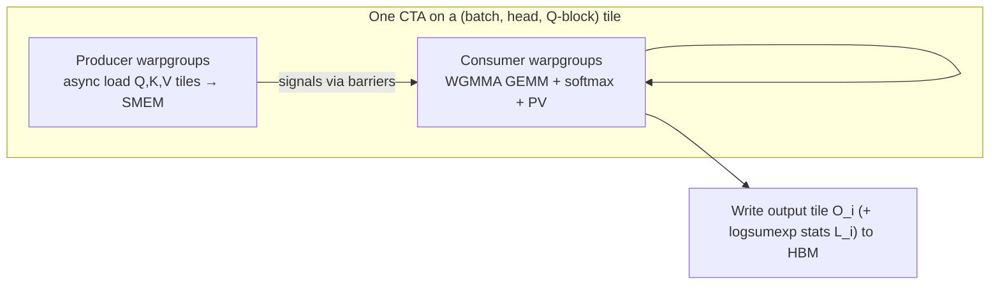
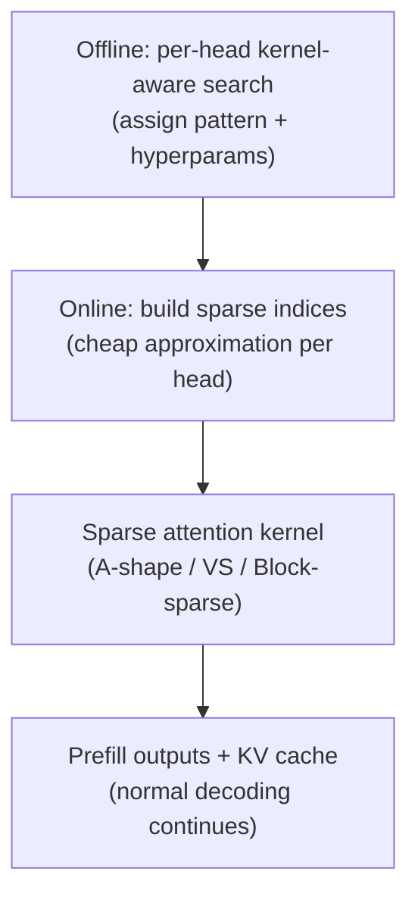
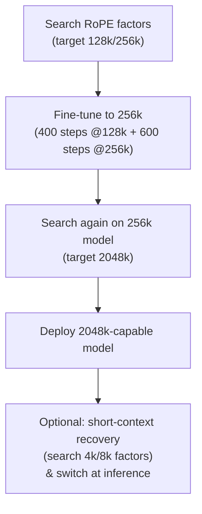
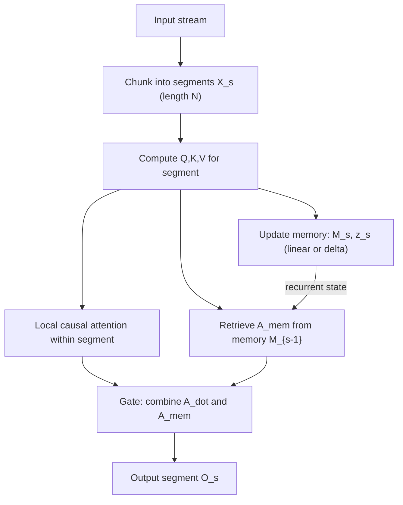

# Attention kernels and context extension in 2024: analytical comparison of FlashAttention-3, MInference 1.0, LongRoPE, and Infini-attention

## Executive summary

Long-context Transformer performance is constrained by two intertwined bottlenecks: (i) **the quadratic compute of attention** with respect to sequence length, and (ii) **the memory-system cost** of moving Q/K/V (and often KV-cache) data through GPU/TPU memory hierarchies. The four 2024 papers you specified attack different slices of this problem (often complementary rather than mutually exclusive): **FlashAttention-3** is a *hardware-aware exact-attention kernel*; **MInference 1.0** is a *training-free, inference-time dynamic sparse attention* method targeting **prefill** latency; **LongRoPE** is a *positional-embedding rescaling + lightweight fine-tuning strategy* that pushes RoPE-based models to **~2M-token positional ranges**; and **Infini-attention** is a *model-architecture modification* that adds a **bounded-size compressive memory** to enable (in principle) **unbounded streaming context**. citeturn3view0turn6view0turn11view0turn17view0

A useful high-level framing is:

- If you want **the same attention computation, faster**, you are in kernel-land: FlashAttention-3. It keeps attention *exact* but aims to approach peak hardware utilization on Hopper-class GPUs via asynchronous pipeline design and FP8 support. citeturn23view1turn24view0  
- If you want **to make million-token prompts practical on a single GPU without retraining**, you are in *approximate attention for prefill*: MInference 1.0. It exploits empirically observed **structured sparsity** in long-context attention matrices and uses **custom sparse kernels** to skip most attention-score computations. citeturn10view0turn10view1turn32view3  
- If you want a pretrained RoPE model to **remain positionally stable** at very large position indices (hundreds of thousands to millions), you are in *positional scaling + adaptation*: LongRoPE. It modifies only the RoPE rescaling rule (plus progressive fine-tuning) and claims a 2048k positional range, but does **not** change the fundamental quadratic attention cost. citeturn11view0turn16view2turn16view4  
- If you want **bounded memory footprint regardless of total past context**, you are in *recurrent/segment memory architectures*: Infini-attention. It replaces “attend-to-all-past” with “attend locally + retrieve from compressive memory,” enabling streaming inference with constant per-layer memory state. citeturn20view2turn20view4

A practical decision rule (assuming you can combine methods):

- **Production inference, dense attention, Hopper GPUs**: start with FlashAttention-3 (or later integrated variants) for throughput/latency improvements while preserving exactness. citeturn23view2turn24view0  
- **Production inference, very long prompts (≥128k → 1M) where time-to-first-token dominates**: consider MInference 1.0 for **prefill acceleration**, often alongside a fast dense kernel for the remaining computations. citeturn6view0turn10view4turn26view0  
- **Long-context adaptation/training of RoPE-based models**: LongRoPE provides a concrete, search-driven recipe to extend RoPE position handling to the million-token regime (but you still need systems techniques—efficient kernels, distribution, or sparsity—to make full use of it). citeturn16view2turn16view5turn27view0  
- **Streaming “infinite history” agents / continual pretraining research**: Infini-attention is the most directly targeted, but it changes architectural assumptions (segment recurrence, memory compression). Independent replication reports suggest nontrivial training/convergence and memory-utility challenges as compression depth increases. citeturn20view2turn20view4turn29view0

## FlashAttention-3

**Concise background.** FlashAttention-3 (arXiv:2407.08608) is an *exact attention* kernel design that builds on FlashAttention/FlashAttention-2 by explicitly exploiting newer GPU features (notably Hopper) to close the utilization gap between attention and highly optimized GEMM kernels. The paper argues FlashAttention-2 reaches ~35% of theoretical peak FLOPs on H100, motivating new kernel scheduling and low-precision design. citeturn3view0turn31view0

**Problem statement.** Exact attention has an inherent quadratic compute cost in sequence length, and on modern GPUs the bottleneck is frequently *memory movement + instruction scheduling*, not arithmetic. FlashAttention-3’s target is to reduce wall-clock time by better overlapping data transfers, GEMMs, and softmax, and by enabling FP8 execution with reduced numerical error compared to naïve FP8 attention. citeturn3view0turn23view1turn4view3

**Key technical contributions.** The paper’s contributions are organized around three ideas: (i) producer–consumer asynchrony via warp specialization and asynchronous memory movement, (ii) hiding softmax under GEMM using scheduling/pipelining so non-GEMM operations do not serialize the critical path, and (iii) FP8 support with reduced error via block quantization and “incoherent processing.” citeturn3view0turn4view1turn23view0turn23view1

### Mathematical formulations and numerically stable blockwise softmax

FlashAttention-3 retains the standard single-head attention definition:
\[
S = \alpha QK^\top,\quad P=\mathrm{softmax}(S)\ (\text{row-wise}),\quad O=PV,
\]
typically with \(\alpha = 1/\sqrt{d}\) for head dimension \(d\), and practical implementations stabilize softmax by subtracting row-wise maxima before exponentiation. citeturn21view0turn23view1

The “Flash” family’s core mathematical trick is *online softmax normalization*: compute \(O\) without materializing the full \(N\times N\) attention matrix in global memory by iterating over key/value tiles and maintaining running log-sum-exp statistics. FlashAttention-3’s Algorithm 1 (CTA view) shows, for a query tile \(Q_i \in \mathbb{R}^{B_r\times d}\) and key/value tiles \(K_j,V_j \in \mathbb{R}^{B_c\times d}\), maintaining per-query-row running max \(m\) and normalizer \(\ell\). In a compact form (row-wise, omitting indices for clarity):
\[
m^{\text{new}}=\max(m,\ \max S^{(j)}),\quad
\tilde P^{(j)}=\exp(S^{(j)}-m^{\text{new}}),
\]
\[
\ell^{\text{new}}=\exp(m-m^{\text{new}})\ell+\mathrm{rowsum}(\tilde P^{(j)}),
\]
\[
O^{\text{new}}=\exp(m-m^{\text{new}})O+\tilde P^{(j)}V_j,
\]
and finally \(O \leftarrow \mathrm{diag}(\ell)^{-1}O,\ L=m+\log \ell\) for log-sum-exp outputs used in backward pass. This corresponds directly to the update steps in Algorithm 1 (lines updating \(m_i\), \(\ell_i\), and \(O_i\)). citeturn4view0

**Intuition.** You can read this as a streaming reduction: each key-block contributes some probability mass and some value-weighted sum, but because softmax renormalization changes as new blocks arrive, FlashAttention keeps the “renormalize factor” explicitly via \(m\) and \(\ell\) so earlier partial sums can be rescaled consistently. citeturn4view0turn31view0

### Algorithmic details and kernel scheduling

At the algorithm level, FlashAttention-3’s forward pass is still tiled over (batch, head, query blocks). The novelty is the *execution model* within a CTA:

- A **producer warpgroup** issues asynchronous loads of \(Q_i\) and successive \((K_j,V_j)\) tiles into shared memory using Hopper-era mechanisms, while a **consumer warpgroup** performs the two GEMMs (\(QK^\top\) and \(PV\)) and the softmax bookkeeping. citeturn4view0turn3view0  
- To mitigate a practical throughput limiter—softmax’s exponentials and reductions operating on a slower functional unit than Tensor Core GEMMs—the paper proposes **ping-pong scheduling** across two warpgroups so that one does softmax while the other does GEMMs (and then swap). citeturn4view0turn4view1turn31view0  
- Beyond inter-warpgroup overlap, Algorithm 2 describes a **2-stage pipeline** inside the consumer warpgroup, overlapping the next iteration’s \(QK^\top\) computation with the current iteration’s softmax operations, at the cost of increased register pressure. citeturn4view2turn4view1turn23view1  

The following flow diagram summarizes the intended kernel structure (paraphrasing Algorithm 1/2 and “pingpong” scheduling):

The paper emphasizes this is designed around Hopper-specific asynchrony and scheduling controls. citeturn4view0turn4view1turn4view2

### FP8, block quantization, and incoherent processing

FlashAttention-3 adapts the forward pass to use FP8 Tensor Cores. FP8 introduces significant quantization error, especially with “outlier” activations common in large models, so the paper adds two error-mitigation techniques. citeturn23view0turn23view1turn22view1

1) **Block quantization.** Instead of a single scale per tensor, the method keeps **one scale per block** (aligned with the attention tiling). Q/K/V are split into blocks of size \(B_r\times d\) or \(B_c\times d\) and quantized separately; because the algorithm already operates blockwise, it can rescale score blocks accordingly “at no computation cost” (as described). citeturn23view0turn21view0

2) **Incoherent processing.** Multiply both \(Q\) and \(K\) by the same random orthogonal matrix \(M\) before quantization:
\[
(QM)(KM)^\top = Q(MM^\top)K^\top = QK^\top,
\]
so the exact attention scores are unchanged in real arithmetic, but outliers are “spread” across coordinates, reducing quantization error. The paper notes a practical choice for \(M\) as products of random sign diagonals and a Hadamard matrix, enabling multiplication in \(O(d\log d)\) rather than \(O(d^2)\), and suggests it can be fused with rotary embedding in memory-bandwidth-bound regimes. citeturn23view1turn21view0turn31view0

### Complexity analysis

**Asymptotic compute.** FlashAttention-3 does not change the fundamental arithmetic count of dense attention: it still computes both \(QK^\top\) and \(PV\), which scale as \(\Theta(N^2 d)\) per head. The paper’s benchmark FLOPs model for forward pass is explicitly \(4 \cdot \text{seqlen}^2 \cdot \text{head\_dim} \cdot \text{num\_heads}\) (and divides by ~2 for causal masking). citeturn23view1turn21view0

**Memory traffic / intermediate storage.** The key reduction—shared with earlier FlashAttention versions—is that intermediate attention matrices are not written to global memory; the computation is fused and tiled so memory use is closer to linear in sequence length (with respect to avoiding \(N^2\) intermediates). This “quadratic-to-linear (intermediate) memory” idea is emphasized in the FlashAttention recap materials and remains structurally true here. citeturn31view0turn3view0

### Implementation notes (kernels, GPU specifics, batching, numerical stability)

- **Hardware specificity.** The open-source implementation frames FlashAttention-3 as optimized for Hopper GPUs (H100/H800), with requirements of CUDA ≥ 12.3 (CUDA 12.8 recommended). citeturn24view0  
- **Instruction-level mechanisms.** The paper’s implementation discussion points to using Hopper-era primitives (e.g., TMA for async loads, WGMMA for Tensor Core GEMMs), explicit register allocation controls, and barrier-based scheduling for overlap. citeturn4view0turn23view1turn31view0  
- **Attention variants.** The paper states it follows FlashAttention-2’s approach for MQA/GQA and adjusts tensor indexing to avoid duplicating K and V in HBM. citeturn4view1  
- **Numerical stability choices.** The numerical error evaluation describes FP16 FlashAttention variants achieving lower RMSE than standard attention because intermediate softmax operations are kept in FP32, and FP8 baseline uses per-tensor scaling with FP32 matmul accumulation but FP16 softmax intermediates. citeturn23view3turn4view3  
- **Release surface.** The flash-attention repository states that in the beta release, FP16/BF16 forward+backward and FP8 forward are provided. citeturn24view0

### Strengths, limitations, practical use cases

**Strengths.** FlashAttention-3’s central strength is that it **preserves exact attention** while substantially improving hardware utilization on Hopper. It reports FP16 forward speedups of ~1.5–2.0× over FlashAttention-2 and reaches up to ~740 TFLOPs/s (reported as ~75% of H100 theoretical max), and FP8 reaching close to ~1.2 PFLOPs/s. citeturn3view0turn23view1turn31view0

**Limitations.**  
- The design is explicitly **Hopper-centric**; portability to other accelerators is not the primary focus (even though the paper suggests ideas may generalize). citeturn3view0turn24view0  
- The paper’s own discussion notes remaining gaps such as further optimization for LLM inference and differences between FP16 and FP8 kernel design maturity (e.g., persistent kernel/load balancing discussed in context). citeturn4view3turn23view1  
- FlashAttention-3 does **not** change the quadratic scaling of dense attention; it makes the constant factors smaller and improves utilization. For million-token contexts, dense attention remains computationally extreme without additional sparsity/distribution strategies. citeturn21view0turn23view1turn32view3  

**Typical use cases.**  
- **Training** large Transformers on GPUs where attention is a major throughput limiter, particularly on Hopper. citeturn24view0turn23view2  
- **Inference** for moderate-to-long contexts where exactness matters and GPU utilization is critical (noting Hopper requirements). citeturn24view0turn23view2  
- As a **building block** combined with context-extension techniques (e.g., LongRoPE positional scaling) or sparsity (e.g., MInference) to make long-context feasible end-to-end, since FlashAttention-3 targets the kernel layer while leaving model-level context mechanisms unchanged. citeturn11view0turn6view0turn3view0  

## MInference 1.0

**Concise background.** MInference 1.0 (arXiv:2407.02490) focuses on the **prefill stage** of long-context LLM inference (processing the prompt and producing the first token). It argues prefill becomes prohibitively slow for million-token prompts because self-attention dominates runtime. citeturn6view0turn32view3

**Problem statement.** For an 8B model, the paper reports that processing a 1M-token prompt can take ~30 minutes on a single A100 GPU, and attention can exceed 90% of total prefill latency—yielding unacceptable “Time To First Token.” citeturn32view3turn6view0

**Key technical contributions.** MInference proposes a *training-free* inference method that exploits structured sparsity patterns in long-context attention matrices:

1) Identify three recurring spatial sparsity patterns across attention heads (A-shape, Vertical-Slash, Block-Sparse). citeturn10view0turn6view0  
2) Assign each head an optimal pattern offline using a **kernel-aware** search constrained by a FLOPs budget. citeturn10view1turn7view0  
3) At inference time, approximate sparse indices online with low overhead, then compute attention using custom sparse GPU kernels tailored to each pattern. citeturn10view1turn10view3turn9view2  

### Mathematical formulation of dynamic sparse attention

The paper models sparse attention by applying a binary mask \(M\in\{0,1\}^{S\times S}\) to the attention logits using a large negative penalty:
\[
A(M) = \mathrm{Softmax}\Big(\frac{1}{\sqrt{d}}QK^\top - c(1-M)\Big),
\]
where \(c\) is “a large constant” (example given \(1e5\)) to drive masked entries to ~0 probability after softmax. citeturn10view0turn7view0

It frames the goal as a bi-criterion tradeoff between (i) closeness to dense attention output and (ii) total runtime (sparse compute plus overhead to estimate/build indices):
\[
\min |A(M)-A_{\text{dense}}|,\qquad \min\ t_{\text{sparse}}(M)+t_{\text{overhead}}(M).
\]
This makes explicit that sparse attention is only worthwhile if index estimation overhead is controlled. citeturn10view1turn7view0

### Algorithmic details

**Offline head-pattern assignment (Kernel-Aware Sparse Pattern Search).** Algorithm 1 builds a search space of pattern settings (e.g., number of vertical/slash lines, number of top blocks) such that each candidate has similar *real kernel FLOPs* (using a FLOPs-in-kernel routine), then selects the pattern that best matches dense attention output on a reference sample. citeturn10view1turn7view0

**Online index approximation.** The online approximation differs by head type:

- **Vertical-Slash heads.** Compute a small attention estimate using only the *last_q* queries (paper uses last_q=64) against all keys, then choose top vertical and slash structures via aggregation/sums and top-k selection before running sparse attention on those indices. citeturn10view1turn7view1  
- **Block-Sparse heads.** Mean-pool Q and K into blocks (paper uses block_size=64), compute block-level attention, select top blocks, then run sparse attention on those blocks. The paper motivates this via commutativity of mean pooling and matmul to approximate the underlying block importance with minimal overhead. citeturn10view1turn10view2  
- **A-shape heads.** The paper notes the sparse mask is static for A-shape heads (hence no dynamic mask-building overhead). citeturn10view2turn9view1  

The overall pipeline is usefully summarized as:

This is a direct paraphrase of the paper’s stated three-step system design (offline identification → online index build → sparse kernel compute). citeturn10view0turn10view1turn32view3

### Kernel implementation and complexity analysis

The paper provides kernel-level details in Appendix C.4:

- **Block-Sparse FlashAttention kernel.** Implemented based on a Triton FlashAttention kernel; for selected block indices, each thread block loops over the top-K blocks in a row. The paper states latency is approximately linear in the number of blocks, and it gives an approximate speedup ratio vs dense FlashAttention:
\[
s_p \approx \frac{S}{2B\cdot k_b}.
\]
The variables are not fully redefined in the equation snippet itself; in context, \(S\) is sequence length, \(B\) is the block size, and \(k_b\) is the number of selected blocks per row (as described in the surrounding text). citeturn10view3turn9view2  

- **Vertical-Slash kernels.** VS uses (i) a sparse-index kernel (Algorithm 4 in appendix) that merges “point” (vertical) and “range” (slash) structures, with stated per-row index build complexity \(O(k_v+k_s)\), and (ii) a hybrid sparse attention kernel mixing block-sparse FlashAttention and PIT-based sparse attention for column-wise structures. citeturn10view3turn9view2  

**Overall compute complexity (conceptual).** If dense attention is \(O(S^2 d)\), MInference aims to reduce it to roughly \(O(\rho S^2 d)\) where \(\rho\) is the retained attention area fraction (pattern-dependent), plus overhead that the paper keeps small by using last_q sampling and block pooling. The paper explicitly claims reducing about **95% of FLOPs** in attention computation (i.e., \(\rho\approx 0.05\)) for long-context scenarios. citeturn6view0turn5search1

**Overhead accounting.** The paper reports that, in measured settings, ~5%–20% of overhead can be spent on dynamic sparse index building, with the remaining time on sparse attention computation. citeturn32view4

### Implementation notes (kernels, batching, stability, integration)

- **Reference configuration choices.** The paper specifies last_q=64 and block_size=64 for VS and Block-Sparse patterns, and reports BF16 latency experiments on a single A100. citeturn10view2turn9view1  
- **Tooling stack.** The paper describes an implementation built in PyTorch using FlashAttention, Triton, and PIT. citeturn10view2turn9view1  
- **Compatibility with KV-cache methods.** The paper states it can be combined with KV-cache compression (example SnapKV) and presents results that performance largely remains stable in such combinations. citeturn32view4  
- **Ease-of-use packaging.** The official repository provides `pip install minference`, lists dependencies (Torch, Triton, Transformers ≥ 4.46.0, optional FlashAttention-2), and programmatic access to supported attention types and supported models. citeturn26view0  

### Strengths, limitations, practical use cases

**Strengths.**  
- **Targets the right pain point for users:** prefill latency and TTFT for extremely long prompts. citeturn32view3turn6view0  
- **Training-free** and intended to be applied to existing pretrained LLMs without modifications to pretraining or additional fine-tuning. citeturn6view0turn5search0  
- Demonstrates large practical speedups (up to **10× for 1M-token prompts on a single A100**, and reduction of 30 minutes → 3 minutes in reported conditions). citeturn32view4turn6view0  

**Limitations.**  
- It is fundamentally an **approximation** to dense attention; the method works best when the head’s attention mass truly concentrates into the assumed structured patterns, which may not hold uniformly across domains or tasks. The paper’s own formulation makes this an explicit tradeoff objective. citeturn10view1turn7view0  
- The approach introduces non-negligible but bounded **index estimation overhead** (reported 5–20%). citeturn32view4  
- The optimization is primarily for **prefill**; decoding-stage costs (KV-cache, autoregressive steps) are outside the main optimization target, though the paper positions MInference as complementary to KV-cache–centric decoding methods. citeturn32view4turn6view0  

**Practical use cases.**  
- **Long-document retrieval / Needle-in-a-haystack style workloads** requiring million-token prompts where TTFT dominates user experience. citeturn6view0turn10view4  
- **Serving long-context chat or agents** where prompts accumulate to hundreds of thousands of tokens and you can accept controlled approximation to attention during prefill. citeturn32view3turn6view0  
- **Hybrid deployments**: MInference for prefill acceleration + a fast dense kernel (FlashAttention family) for remaining attention work and decoding stage, as the paper explicitly builds on FlashAttention/Triton kernels. citeturn10view2turn9view1turn24view0  

## LongRoPE

**Concise background.** LongRoPE (arXiv:2402.13753) addresses context-length extension for RoPE-based pretrained LLMs. It argues common context-extension methods plateau around ~128k tokens due to (i) fine-tuning cost, (ii) scarcity of extremely long texts, and (iii) “catastrophic values” / out-of-distribution issues from unseen positional indices. LongRoPE proposes a search-driven, non-uniform rescaling of RoPE plus a progressive extension strategy to reach **2048k (2,048k) tokens**. citeturn11view0turn16view0turn16view2

**Problem statement.** RoPE interpolation methods that uniformly rescale positions (or apply simple dimension-group heuristics) can cause “crowding” of positional information and degrade both long-context and short-context performance. LongRoPE seeks RoPE rescale factors that preserve critical positional information—especially in early tokens and high-frequency RoPE dimensions—while still allowing the model to operate at extremely large position indices. citeturn16view0turn15view0

**Key technical contributions.** The paper highlights: (i) identifying two non-uniformities (across RoPE dimensions and across token positions) and exploiting them via efficient evolutionary search; (ii) a **progressive extension** pipeline that fine-tunes at 256k then re-interpolates to 2048k without requiring direct training at 2048k lengths; and (iii) a readjustment step to recover short-context performance by re-searching for 4k/8k regimes and switching factors at inference time for short sequences. citeturn11view0turn16view2turn15view0

### Mathematical formulation: RoPE rescaling with two non-uniformities

The paper writes RoPE features (simplified) for token position \(n\) as:
\[
[\cos(n\theta_0),\sin(n\theta_0),\ldots,\cos(n\theta_{d/2-1}),\sin(n\theta_{d/2-1})],
\]
with \(\theta_i=\theta^{-2i/d}\) and typical base \(\theta=10000\). citeturn11view0turn16view0

For context extension ratio \(s = L'/L\), it unifies interpolation/extrapolation methods as rescaling the effective angle by a factor \(\lambda(\beta)_i\) (notation in paper), producing terms of the form \(\cos(n/\lambda(\beta)_i \cdot \beta_i)\) and \(\sin(\cdot)\). citeturn11view0turn16view0

LongRoPE’s central additional degree of freedom introduces a token-position threshold \(\hat n\) and per-dimension rescale factors \(\hat\lambda_i\) via:
\[
\mathrm{RoPE}(n)_i = \cos(I(\hat\lambda_i,\hat n)\cdot n\beta_i),\ \sin(I(\hat\lambda_i,\hat n)\cdot n\beta_i),
\]
where
\[
I(\hat\lambda_i,\hat n)=
\begin{cases}
1,& n < \hat n\\
1/\lambda_i,& n\ge \hat n
\end{cases}
\]
(as written in the paper’s Eq. (3) definition). This implements “**no interpolation** for the first \(\hat n\) positions” while applying learned rescaling past that point. citeturn15view0turn16view2

The optimization goal is posed as selecting these factors to minimize next-token prediction loss/perplexity on samples exceeding the target length \(L'\). citeturn15view0turn16view2

### Evolutionary search algorithm and progressive extension

**Search space.** The paper defines a search space where (a) each RoPE dimension has a rescale factor \(\lambda_i\) searched from 1.0 up to \(s\times 1.25\) with step size 0.01, and (b) \(\hat n\) is searched over a discrete set \(\{0,1,2,4,8,\ldots,256\}\). citeturn15view0turn14view0

**Algorithm (evolution search).** Algorithm 1 uses a population-based loop: initialize population (seeded with PI/NTK/YaRN solutions plus mutations), compute perplexity for individuals, keep top-k parents, generate mutation and crossover children with constraints, iterate for \(T\) steps, return lowest-perplexity solution. citeturn16view2turn15view0

Two explicit efficiency techniques:  
- **Seeded initial population** using existing PI/NTK/YaRN settings rather than purely random initialization. citeturn15view0turn16view2  
- **Monotonic non-decreasing constraint** \(\lambda_i \le \lambda_{i+1}\) so higher RoPE dimensions (lower frequency) can be interpolated more than lower dimensions (higher frequency), pruning obviously poor candidates and reducing expensive perplexity computations. citeturn15view0turn16view2  

**Progressive extension to 2048k.** The paper’s staged recipe is:

1) Search rescale factors for 128k and 256k targets. citeturn15view0turn16view2  
2) Fine-tune to 256k by first training 400 steps using 128k factors, then switching to 256k factors and training 600 more steps (total 1k steps). citeturn15view0turn16view3  
3) Perform a secondary search on the 256k fine-tuned model to extend from 256k to 2048k (8×) **without additional fine-tuning**. citeturn15view0turn16view3  
4) Optional recovery: re-run search for 4k/8k to reduce “crowding” and dynamically switch factors at inference for short sequences. citeturn15view0turn16view3  

A flow diagram for the full pipeline:

This is a direct condensation of the paper’s stated “progressive extension” plus recovery strategy. citeturn15view0turn16view3turn11view0

### Complexity and resource considerations

**Attention compute remains dense.** LongRoPE does not change the attention mechanism itself—only the positional embedding scaling—so dense attention remains quadratic in \(N\). This is why the paper spends much of its effort on *positional stability* and *fine-tuning efficiency*, not inference-time attention cost reduction. citeturn11view0turn16view3turn32view3

**Search and fine-tuning costs (explicit).** The paper provides concrete training-resource notes: the 128k fine-tune used 8 A100 GPUs for a week (400 steps), and 256k fine-tuning doubled to 16 A100 GPUs for two weeks (600 steps). citeturn16view5turn16view3

It also discusses search efficiency and cost as driven by the time to evaluate perplexity at large target context lengths; for very long contexts, it uses multiple A100 GPUs to keep total search time bounded. citeturn16view5turn15view0

### Implementation notes and availability

- The paper claims LongRoPE can be applied to any RoPE-based LLM and keeps the original model architecture with only minor positional-embedding modifications, enabling reuse of existing optimizations. citeturn11view0turn0search2  
- The official repository provides scripts for evolution search and evaluation, and notes environment setup requiring CUDA ≥ 11.7 for flash-attn (as stated in the quick start). citeturn27view0  
- The repo also notes that (at least at the time of that snapshot) only the **evolution search** portion is released (“policy restrictions” noted), and training can be done using external training techniques. citeturn27view0  

### Strengths, limitations, use cases

**Strengths.**  
- Provides a concrete method to push RoPE positional handling to **2048k** with relatively small fine-tuning steps (1k) at ≤256k training lengths. citeturn11view0turn15view0  
- Maintains performance across a wide range of evaluation lengths; the paper reports strong passkey retrieval and perplexity behaviors (including tables/figures showing performance across lengths up to 2048k). citeturn16view4turn16view2  

**Limitations.**  
- **Does not solve compute/memory scaling of dense attention** at million-token lengths; it solves the positional-embedding extrapolation aspect. In practice, using a 2M-token context still demands heavy systems techniques (efficient kernels, distribution, sparsity) to be feasible at scale. citeturn32view3turn21view0turn11view0  
- The evolution search and progressive pipeline introduce nontrivial engineering and compute cost; the paper provides large-GPU resource figures for fine-tuning. citeturn16view5turn15view0  
- The repository suggests incomplete release of the full training pipeline at the time captured, which may limit straightforward reproduction for end users. citeturn27view0  

**Practical use cases.**  
- Building **RoPE-based long-context models** (hundreds of thousands to millions of tokens) where the primary failure mode is positional extrapolation degradation rather than kernel inefficiency. citeturn11view0turn16view2  
- **Research prototyping** of extreme-context in-context learning and retrieval tasks, with LongRoPE paired with efficient attention kernels and/or sparse/distributed attention to manage runtime. citeturn11view0turn31view0turn6view0  

## Infini-attention

**Concise background.** Infini-attention (arXiv:2404.07143) proposes a Transformer modification to handle **infinitely long inputs** with bounded memory and compute by introducing a per-layer **compressive memory** and combining **local causal attention** with **long-term “linear attention” style retrieval** within the same block. citeturn17view0turn20view2

**Problem statement.** Full self-attention has quadratic memory footprint and compute; KV states and attention matrices become prohibitively large for very long contexts. Infini-attention uses a compressive memory to avoid carrying explicit KV history, aiming for streaming operation. citeturn17view0turn20view2

**Key technical contributions.**  
- Adds a recurrent state per attention layer (compressive memory + normalization) so old KV information is *stored rather than discarded* across segments. citeturn17view0turn20view2  
- Casts memory update/retrieval as a stable linear-attention-like mechanism (following Katharopoulos et al.-style normalization) with optional delta-rule update. citeturn20view1turn20view2  
- Aggregates retrieved long-term context with local dot-product attention using a learned per-head gating scalar. citeturn20view2turn19view4  
- Demonstrates long-context language modeling and long-context tasks, including passkey retrieval up to 1M and 500K book summarization in reported experiments. citeturn20view4turn20view5turn17view0  

### Mathematical formulation (key equations)

Infini-attention processes input in **segments** \(X_s\in\mathbb{R}^{N\times d_{\text{model}}}\) (segment length \(N\)), maintaining a memory state \(M_{s}\) across segments:
\[
O_s, M_s = \mathrm{infini\text{-}attention}(X_s, M_{s-1}). 
\]
citeturn20view1turn17view0

**Local scaled dot-product attention** (per head) remains standard:
\[
K=XW_K,\quad V=XW_V,\quad Q=XW_Q,
\]
\[
A_{\text{dot}}=\mathrm{softmax}\Big(\frac{QK^\top}{\sqrt{d_{\text{model}}}}\Big)V
\]
(with causal masking in the intended autoregressive setting). citeturn20view1turn20view0

**Memory retrieval** from an associative matrix memory \(M_{s-1}\in\mathbb{R}^{d_{\text{key}}\times d_{\text{value}}}\) uses a nonlinear feature map \(\sigma\) and a normalization vector \(z_{s-1}\in\mathbb{R}^{d_{\text{key}}}\):
\[
A_{\text{mem}}=\frac{\sigma(Q)M_{s-1}}{\sigma(Q)z_{s-1}}. 
\]
The paper specifies \(\sigma\) as element-wise ELU+1 and records a sum over keys for normalization for stability. citeturn20view1turn20view2

**Memory update** (linear rule) is:
\[
M_s \leftarrow M_{s-1} + \sigma(K)^\top V,\qquad
z_s \leftarrow z_{s-1} + \sum_{t=1}^{N}\sigma(K_t).
\]
citeturn20view2turn19view4

**Delta-rule variant** (“Linear + Delta”) refines the update by subtracting the retrieved value before binding:
\[
M_s \leftarrow M_{s-1} + \sigma(K)^\top\Big(V - \frac{\sigma(K)M_{s-1}}{\sigma(K)z_{s-1}}\Big).
\]
citeturn20view2turn19view4

**Fusion (gating) of local and memory contexts** uses a learned scalar \(\beta\) per head:
\[
A = \sigma_g(\beta)\odot A_{\text{mem}} + (1-\sigma_g(\beta))\odot A_{\text{dot}},
\]
where \(\sigma_g\) is sigmoid. This is explicitly described as adding only one scalar parameter per head. citeturn20view2turn18view0

### Algorithmic flow and architectural intuition

Infini-attention is best understood as a **two-path token mixer**:

- **Short-range path:** local causal attention within the current segment.  
- **Long-range path:** retrieve a compressed representation of all prior segments from \(M_{s-1}\) using current queries.  
- **Gate and combine**, then update memory with current keys/values.

This matches the method narrative plus equations for retrieval/update/gating. citeturn20view1turn20view2turn20view3

### Complexity and scaling analysis

Let total context length be \(T = S\cdot N\) tokens (S segments of length N).

- **Compute.** Local attention per segment costs \(O(N^2 d)\) (per layer/head aggregate constant factors omitted), and memory retrieval/update costs \(O(N d_{\text{key}} d_{\text{value}})\). Over \(S\) segments, total is:
  \[
  O(SN^2 d) + O(SN d_{\text{key}} d_{\text{value}}) = O(TN d) + O(T d_{\text{key}} d_{\text{value}}).
  \]
  Thus compute becomes **linear in total length \(T\)** for fixed segment size \(N\), rather than quadratic in \(T\) as in dense attention. This “segment-local quadratic + global linear retrieval” structure is implicit in the paper’s segment design and memory equations. citeturn20view0turn20view2turn19view4  

- **Memory.** The key promise is bounded memory: per layer it stores \(M_s\) and \(z_s\), with constant size \(d_{\text{key}}\times d_{\text{value}} + d_{\text{key}}\) per head (and the paper summarizes a constant-memory claim in its discussion of Table 1). citeturn20view2turn19view4  

### Implementation notes (segmenting, training dynamics, positional embeddings)

- **Segment chunking.** The paper describes segmenting at the Infini-attention layer: it processes inputs segment-by-segment but concatenates outputs so the next layer receives the original-length sequence representation. citeturn19view4turn20view3  
- **Training with recurrence.** It explicitly mentions training with back-propagation through time (BPTT) over compressive memory states and using gradient checkpointing for memory savings. citeturn19view4turn20view3  
- **Position embeddings.** It states PEs are not used for the key/query vectors of the compressive-memory mechanism (to store only global information), and are applied to QK vectors only after compressive memory reading and update. citeturn20view4turn19view4  
- **Quantitative reporting.** The paper provides comparisons of memory footprint and “compression ratio” against other memory-based Transformer variants (Table 1/2), and experiments at segment length \(N=2048\) and training sequence length 32768 (16 unroll steps). citeturn20view2turn20view4turn19view4

**Code availability.** The paper PDF itself does not specify an official released code repository in the captured excerpts; multiple third-party repositories describe their implementations as “unofficial,” and at least one explicitly claims the official code had not been released at the time of writing. This should be treated as secondary evidence rather than an author guarantee. citeturn28search0turn28search1

### Strengths, limitations, use cases

**Strengths.**  
- Offers a clear architectural mechanism for **streaming long context** with bounded memory state, and includes a gating mechanism to balance short- and long-range information per head. citeturn20view2turn20view3  
- Reports strong results on long-context tasks in its experiments: e.g., Table 2 shows improved perplexity vs compared baselines with a stated 114× compression ratio; Table 3 reports passkey retrieval after fine-tuning up to 1M; Table 4 reports 500K book summarization Rouge improvements. citeturn20view4turn20view5turn19view4  

**Limitations.**  
- The method’s effectiveness depends on how well the compressive memory can store/retrieve relevant information under repeated updates; the paper’s own design makes this an information-compression problem, which may be task dependent. citeturn20view2turn17view0  
- Independent reproduction work from entity["organization","Hugging Face","ai platform"] reports that Infini-attention performance degraded as the number of memory compressions increased, concluding (in their experiments) that other long-context strategies remained preferable; this is external to the paper and should be read as replication evidence rather than a definitive refutation. citeturn29view0  
- The paper does not present GPU-kernel-level optimizations comparable to FlashAttention-3; implementation efficiency on common accelerators is therefore more dependent on standard framework performance and careful engineering choices (segment sizes, batching, checkpointing). This is largely unspecified as a kernel contribution. citeturn20view3turn19view4  

**Practical use cases.**  
- **Streaming agents / long-running conversations** where bounded memory is essential and some lossiness in representing far history is acceptable, particularly when coupled with continual pretraining. citeturn20view5turn17view0  
- **Research on compressive memory mechanisms** integrated into Transformer blocks, including exploring stability and gating behaviors (the paper visualizes learned gating patterns). citeturn20view3turn20view4  

## Comparative analysis and decision matrix

### What each method changes in the stack

A clean way to compare is by “layer” of intervention:

- **FlashAttention-3:** kernel-level scheduling/precision for *exact* dense attention. citeturn23view1turn24view0  
- **MInference 1.0:** inference-time algorithm + kernels for *approximate, structured sparse* attention (prefill-focused). citeturn10view1turn10view3turn6view0  
- **LongRoPE:** positional embedding rescaling + staged adaptation; attention kernel/algorithm unchanged. citeturn15view0turn11view0  
- **Infini-attention:** attention-layer architecture change (segment recurrence + compressive memory), yielding a new compute/memory scaling regime. citeturn20view2turn19view4  

### Comparative tables

#### Quantitative and structural “at a glance”

| Dimension | FlashAttention-3 | MInference 1.0 | LongRoPE | Infini-attention |
|---|---|---|---|---|
| Primary goal | Faster *exact* attention kernel on Hopper | Faster **prefill** via dynamic sparse attention | Extend RoPE context window to **2048k** | Infinite/streaming context with bounded memory |
| Changes to model architecture | None (kernel swap) citeturn3view0 | None to weights; per-head sparse patterns/masks at inference citeturn6view0 | RoPE rescaling factors + staged fine-tuning/search citeturn15view0 | Replace attention layer with local+memory recurrent attention citeturn20view2 |
| Exactness | Exact dense attention citeturn21view0 | Approximate (masked sparse) attention citeturn10view0 | Exact dense attention (positional change only) citeturn11view0 | Exact local attention within segments; global context via compressed retrieval citeturn20view2 |
| Demonstrated / claimed context | Benchmarked up to 16k in paper’s plots; general kernel for long context citeturn23view2 | Demonstrated prefill up to **1M** tokens citeturn6view0turn32view4 | Demonstrated positional range up to **2048k** citeturn11view0turn16view4 | Claims “infinite”; experiments include **1M passkey** and **500K summarization** citeturn17view0turn20view5 |
| Reported speed / efficiency | FP16 up to ~740 TFLOPs/s; FP8 near ~1.2 PFLOPs/s; 1.5–2× over FA2 (H100) citeturn3view0turn23view1 | Up to **10×** prefill speedup at 1M on A100; reduces ~95% attention FLOPs citeturn6view0turn5search1turn32view4 | Focus is quality/extension; does not report kernel speedups (compute remains dense) citeturn11view0 | Reports memory “compression ratio” (e.g., 114×) and perplexity / task benchmarks citeturn20view4turn17view0 |
| Hardware specificity | Requires Hopper for v3 path; CUDA ≥12.3 in repo citeturn24view0 | GPU-centric (Triton/FlashAttention/PIT); paper latency on A100 BF16 citeturn10view2turn6view0 | Hardware-agnostic (model-level), but training/search is resource-heavy citeturn16view5 | Hardware-agnostic in principle; segmenting + BPTT/checkpointing described citeturn20view3 |

#### Complexity and memory footprint comparison (formulas)

Let total sequence length be \(T\), head dim \(d\), number of heads \(H\), segment length \(N\), and assume batch size 1 for simplicity.

| Method | Time complexity (dominant terms) | Memory scaling with \(T\) (excluding model weights) | Notes |
|---|---|---|---|
| FlashAttention-3 | Dense attention: \(\Theta(T^2 d H)\) (paper uses \(4\cdot T^2\cdot d\cdot H\) FLOPs forward) citeturn23view1 | Avoids \(T^2\) intermediates; still needs Q/K/V and KV cache for inference: \(\Theta(T d H)\) citeturn31view0turn21view0 | Kernel reduces IO and increases utilization, not asymptotics citeturn3view0 |
| MInference 1.0 | Approx: \(\Theta(\rho T^2 d H)+\) overhead; claims ~95% FLOPs reduction (small \(\rho\)) citeturn6view0 | Still stores KV like standard attention for prefill; plus sparse indices overhead; index build overhead reported 5–20% citeturn32view4 | Prefill focus; can combine with KV-cache compression citeturn32view4 |
| LongRoPE | Dense attention remains \(\Theta(T^2 d H)\) citeturn11view0turn21view0 | KV cache \(\Theta(T d H)\); no change from positional method citeturn11view0 | LongRoPE addresses positional extrapolation, not attention cost citeturn15view0 |
| Infini-attention | \(\Theta((T/N)\cdot N^2 d H)+\Theta(T d_k d_v H)\approx \Theta(T N d H)\) for fixed \(N\) citeturn20view0turn20view2 | Memory per layer state constant: \(d_k(d_v+1)H\) plus per-segment activations \(\Theta(N d H)\) citeturn20view2turn19view4 | Trades exact global attention for memory retrieval; supports streaming citeturn17view0 |

### Accuracy/precision impacts

- **FlashAttention-3** explicitly studies numerical error: FP16 FlashAttention-3 matches FlashAttention-2 RMSE in their test and shows better RMSE than standard attention due to FP32 softmax intermediates; FP8 with block quantization + incoherent processing reduces RMSE versus baseline FP8 per-tensor scaling (table shows a ~2.6× reduction vs baseline in the described setting). citeturn4view3turn23view3turn23view0  
- **MInference** is approximate by design; the paper motivates preserving attention-weight recall and evaluates across multiple long-context benchmarks, reporting maintained or improved accuracy while speeding prefill. Its objective formulation makes the approximation-vs-speed tradeoff explicit. citeturn10view1turn6view0turn9view1  
- **LongRoPE** targets maintaining perplexity and downstream performance across short and extremely long contexts; it also introduces explicit short-context recovery through re-searching factors for 4k/8k and switching at inference. citeturn15view0turn16view3turn16view4  
- **Infini-attention** introduces lossy compression of past into an associative memory; it reports strong benchmark results, but external replication suggests that as compression repeats, performance may degrade and training stability can be challenging. citeturn20view4turn29view0  

### Ease of integration and compatibility

- **FlashAttention-3**: easiest if you already use flash-attn and have Hopper GPUs; repo provides installation instructions and notes current support surface (FP16/BF16 fwd+bwd, FP8 fwd) with CUDA constraints. citeturn24view0  
- **MInference 1.0**: integration is more involved than a kernel swap because it needs head-wise pattern configs and index-building logic, but the repo provides `pip install minference`, supported methods lists, and claims broad model coverage via adapters. It is also described as compatible with KV-cache compression. citeturn26view0turn32view4  
- **LongRoPE**: conceptually simple at runtime (it is “just RoPE rescaling”), but practically requires an offline search pipeline and staged fine-tuning; repo notes only part of the pipeline may be released at certain times. citeturn15view0turn27view0  
- **Infini-attention**: requires architectural modification and training with segment recurrence; no kernel specialization is presented. Ease depends on willingness to change model code and training loop. citeturn20view3turn19view4  

### Recommended decision matrix by use case

| Use case | Recommended approach | Why | Caveats |
|---|---|---|---|
| Research prototyping: faster exact attention on modern GPUs | FlashAttention-3 | Exactness preserved + high throughput on Hopper; mature kernel focus citeturn23view1turn24view0 | Hopper requirement; doesn’t change quadratic scaling citeturn21view0turn24view0 |
| Production inference: long prompts where TTFT dominates (128k–1M) on a single GPU | MInference 1.0 (+ fast dense kernel) | Targets prefill bottleneck; up to 10× speedup at 1M reported; reduces ~95% FLOPs in attention citeturn6view0turn32view4turn5search1 | Approximation; index overhead 5–20%; needs head configs citeturn32view4turn10view1 |
| Long-context training/adaptation for RoPE-based models into million-token regime | LongRoPE | Explicit recipe for 2048k positional range with progressive extension and short-context recovery citeturn15view0turn16view3turn11view0 | Dense attention cost remains; pipeline is resource-heavy citeturn16view5turn21view0 |
| Streaming “infinite history” inference and continual pretraining research | Infini-attention | Bounded memory per layer; segment streaming; explicit memory retrieval/update equations citeturn20view2turn20view3 | Compression may lose details; replication reports degradation with repeated compression and training difficulties citeturn29view0turn20view2 |
| Combining methods to scale end-to-end | LongRoPE + (FlashAttention-3 and/or MInference) | LongRoPE solves positional extrapolation; FlashAttention-3 accelerates dense kernels; MInference reduces prefill FLOPs for extreme contexts citeturn15view0turn23view1turn6view0 | Requires careful engineering to avoid mismatched assumptions (exact vs sparse vs compressed memory) citeturn10view1turn20view2 |

### A unifying “systems-minded” takeaway

These papers are best seen as addressing different constraints:

- FlashAttention-3 improves **how** dense attention is executed (maximize accelerator utilization) without changing attention’s mathematics. citeturn4view0turn23view1  
- MInference reduces **how much** attention you execute during prefill by predicting and exploiting sparse structure—an algorithmic approximation that becomes more valuable as \(T\) grows into the hundreds of thousands/millions. citeturn10view0turn32view4  
- LongRoPE extends **where** (in position-index space) a pretrained RoPE model remains stable, which is necessary (but not sufficient) for million-token contexts to be meaningful. citeturn16view2turn11view0  
- Infini-attention rethinks **what** “context” means in the model: not a full attention graph over all tokens, but a local window plus a learned compressive memory with linear-style retrieval. citeturn20view2turn17view0